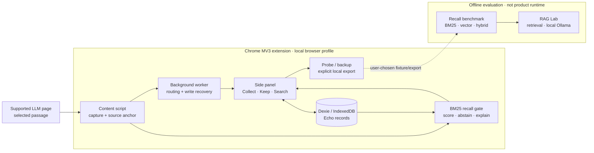

# Echo - AI Product Engineering Case Study

[](https://github.com/ThisIsSophieZ/Echo/actions/workflows/verify.yml)

**A privacy-first, precision-oriented context retrieval system for AI workflows.**

Echo is a Chrome side-panel extension for saving useful context from ChatGPT, Claude, Gemini, and Grok, and resurfacing it when it becomes relevant again.

The project started from a simple problem: useful ideas get buried across long AI conversations, but aggressively resurfacing old context creates a second problem — interruption.

Dogfooding changed the product direction. Instead of maximizing recall, Echo became precision-first: when the evidence is weak, it stays silent.

This repository documents the product decisions, retrieval experiments, browser-extension implementation, and evaluation process behind that shift.

> **Status:** Personal dogfood / alpha. Echo is a local-first prototype and is not currently maintained as a production multi-user service.

## Start here

| Evidence | What it demonstrates |
| --- | --- |
| [Case Study](docs/interview/Echo-case-study.md) | Product pivot, failure analysis, implementation, and measured ship decision |
| [Recall Benchmark](evals/recall-benchmark/) | Reproducible BM25 vs vector vs hybrid comparison |
| [Benchmark Conclusions](evals/recall-benchmark/data/CONCLUSIONS.md) | Why raw vector and hybrid are not shipped |
| [Real Dogfood Holdout](evals/recall-benchmark/data/HOLDOUT-CONCLUSIONS.md) | How a guarded hybrid earned a focused next experiment |
| [RAG Holdout Result](experiments/echo-rag-evaluation/HOLDOUT-RESULT.md) | Frozen retrieval, grounded generation, citations, and abstention evaluation |
| [Decision Logs](docs/decisions/) | Traceable product and technical trade-offs |
| [Privacy & Threat Model](docs/privacy-threat-model.md) | Local data flow, Chrome permissions, risks, and mitigations |
| [Extension Guide](extension/README.md) | How to run the Chrome extension |
| [Contributing](CONTRIBUTING.md) | How to run the extension and recall benchmark |

## Sixty-second product flow

1. **Capture:** select a useful passage in an LLM conversation and save it beside the current workflow.
2. **Recall or abstain:** a precision-first BM25 gate evaluates the current selection and remains silent when evidence is weak.
3. **Explain:** accepted and rejected candidates can be inspected through a Probe ledger and an explicitly exported local recall trace.
4. **Return:** layered message anchors reopen the source conversation and avoid forced low-confidence jumps.

## Architecture and privacy boundary



The extension's core loop does not call a model API or application backend. The offline vector and RAG experiments are kept outside the product runtime. See the [privacy and threat model](docs/privacy-threat-model.md) for permission rationale and residual risks.

## Evidence-backed decisions

- **Prefer precision over recall.** Across 16 dogfood Probe reports, the retrieval pipeline accepted 256 of 1,493 scanned candidates. Manual review showed that many accepted candidates lacked strong phrase-level evidence, so the product gate was tightened rather than adding more model complexity.
- **Advance semantic retrieval by evidence stage.** On the reproducible 55-Echo / 40-query public benchmark, raw vector retrieval improved recall but produced 17.5 false surfaces per 100 queries, compared with 5.0 for product BM25. A later 21-query real-dogfood holdout then identified a more selective guarded hybrid with 0 false surfaces and 100% abstention accuracy, earning it a browser-feasibility prototype rather than an immediate product rollout.
- **Evaluate grounded generation separately from product recall.** On a frozen 14-question public RAG holdout, Candidate BM25 RAG improved correct answer-or-abstain behavior from 3/14 without context to 14/14, with all 16 generated claims manually grounded in cited records. This remains an isolated evaluation path; Echo's user-facing experience stays quiet and retrieval-first.
- **Stay local-first.** Saved Echo content remains in IndexedDB. Reports and backups leave the browser only through explicit user export.
- **Treat browser reliability as product reliability.** Message-anchor fallbacks and MV3 write recovery handle dynamic LLM DOMs, changing message structures, and service-worker suspension.
  
The full rationale and revisit criteria live in the [Decision Logs](docs/decisions/).

## Repository map

```text
Echo/
|-- extension/                      # Chrome MV3 product: Plasmo, React, Dexie
|-- evals/recall-benchmark/         # Offline labeled recall evaluation
|-- experiments/echo-rag-evaluation/ # Frozen retrieval + grounded-generation evaluation
|-- experiments/vector-recall-tidb/ # Earlier isolated vector experiment
|-- docs/                           # Decisions, specs, dogfood, interview evidence
|-- research/                       # Competitive and technical analysis
`-- competitive-intel/echo/         # Dated competitive notes
```

## Reproduce

Use Node.js 24 (recorded in [`.nvmrc`](.nvmrc)).

Extension:

```powershell
cd extension
npm ci
npm test
npm run typecheck
npm run build
npm run dev
# Load build/chrome-mv3-dev as an unpacked Chrome extension.
```

Recall benchmark:

```powershell
cd evals/recall-benchmark
npm ci
npm run all
```

RAG Lab verification (does not run Ollama generation):

```powershell
cd experiments/echo-rag-evaluation
npm ci
npm test
npm run typecheck
```

## Current evidence boundary

- Extension verification on 2026-09-16: **10 test files / 55 tests passed**, followed by a successful typecheck and production build. The RAG Lab also passed **9 focused tests** and typecheck.
- The committed 55-Echo / 40-query fixture provides fully inspectable, reproducible strategy comparisons.
- A separate real-dogfood dev/holdout evaluation adds directional evidence from one user's recent workflow; its private corpus and query text remain unpublished, while the method, aggregate results, limitations, and ship decision are documented.
- Guarded hybrid and grounded generation remain isolated experiments until browser feasibility and a newly collected holdout justify changing the product path.
