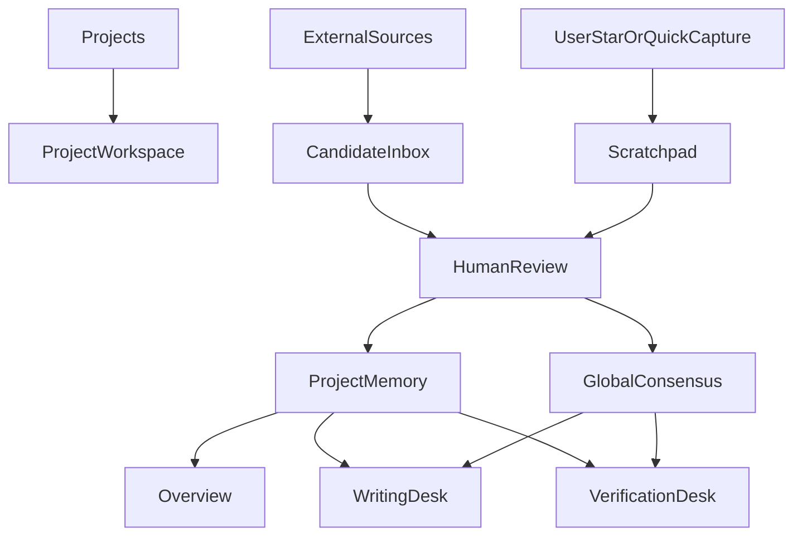

# Information Architecture

## 顶层结构

第一版信息架构采用 `项目优先` 的组织方式，而不是全局混合工作台。

原因很明确：

- 老板的真实工作天然按项目、客户、主题切换。
- 项目是最稳定的上下文边界，能显著减少 AI 串台。
- 用户更容易理解“我进入这个项目，所以系统默认只看这个项目”。
- 后续接入消息、写作、验证、待办时，项目制更容易扩展。

系统默认行为应当是：

- 先在当前项目内检索和召回。
- 当前项目不足时，再补充 `Global Consensus`。
- 默认不跨项目召回，除非用户主动放宽范围。

## 记忆分层

### 1. Project Memory

每个项目自己的长期上下文主库。

适合存放：

- 该项目的事实、决策、历史讨论
- 该项目的资料、草稿、定稿
- 该项目的跟进事项和阶段性判断

规则：

- 默认只在项目内生效。
- 检索时优先级最高。
- 所有条目都必须能追溯来源和时间。

### 2. Global Consensus

所有项目共享的长期共识层。

这不是普通记忆，而是跨项目稳定成立的共识。

适合存放：

- 用户长期写作风格偏好
- 表达禁忌和常见判断标准
- 稳定的业务原则
- 常见技术红线
- 可信来源白名单
- 被多次验证过的通用结论

规则：

- 门槛高于普通项目记忆。
- 必须人工确认后才能进入。
- 最好附带来源或验证依据。
- 时效性内容必须支持复核和降级。
- 模型推断不能直接写入共识层。

### 3. Candidate Inbox

系统自动采集后的候选区。

这是自动化和人工掌控之间的缓冲层，避免系统直接污染正式记忆。

每条候选记忆应展示：

- 摘要
- 来源类型
- 来源位置
- 采集时间戳
- 主题标签
- 相关项目
- AI 留存建议
- 可信度提示
- 潜在冲突提示

支持操作：

- 写入 `Project Memory`
- 提升为 `Global Consensus`
- 拒绝
- 手动编辑后写入
- 合并到已有记忆
- 标记为待观察

AI 在这里的角色是先做自动分拣，而不是直接拍板。

建议先使用三类机器判断：

- 建议保留
- 建议忽略
- 不确定，等待人工判断

### 4. Scratchpad

临时层，用来接住用户当下觉得重要但还没来得及整理的内容。

适合存放：

- 一键星标的重要内容
- 临时念头
- 未确认但不想丢的线索
- 很快要回看的片段

这层的目标是低摩擦捕获，而不是高质量结构化。

后续系统可以围绕这些内容做：

- 优先摘要
- 候选记忆生成
- 提醒和跟进
- 项目归类建议

## 页面结构

### 1. Projects

系统首页应该是项目列表，而不是全局 Dashboard。

这个页面保持克制，只做项目级入口管理。

主要内容：

- 项目列表
- 新增项目
- 归档项目
- 最近进入的项目
- 项目状态概览

### 2. Project Workspace

进入项目后，才进入项目内部工作台。

建议包含这些一级栏目：

- `Overview`
- `Project Memory`
- `Candidate Inbox`
- `Scratchpad`
- `Follow-ups`
- `Research And Drafts`
- `Writing Desk`
- `Verification Desk`

### 3. Overview

项目内的总览页。

主要内容：

- 最近新增记忆
- 待审核候选项
- 已星标的重要内容
- 待跟进事项
- 最近资料与草稿
- 项目活跃主题

### 4. Project Memory

项目内长期记忆库，用来查看和检索已确认内容。

支持视角：

- 按主题
- 按时间线
- 按来源
- 按子任务

支持功能：

- 语义检索
- 时间回放
- 相关记忆推荐
- 冲突记忆提示
- 过时内容复核

### 5. Global Consensus

全局共识层既可以作为独立页面，也可以在项目中以只读侧边面板形式出现。

其目标不是承载大量内容，而是给每个项目提供稳定的长期共识。

### 6. Candidate Inbox

项目级候选记忆入口。

这里应该是高频操作区，因为自动采集后的内容都先经过这一层。

关键要求：

- 时间戳必须清晰可见。
- 能快速区分来源。
- 能看出 AI 为什么建议保留或忽略。
- 能一键决定去向。

### 7. Scratchpad

项目内临时层。

应提供非常低成本的录入方式，包括：

- 一键星标
- 快速粘贴片段
- 临时备注
- 之后再整理

### 8. Writing Desk

虽然不是第一版主战场，但需要在信息架构中预留。

主要区域：

- 写作目标
- 历史素材面板
- 三路 LLM 输出对比区
- 证据引用区
- 定稿区

### 9. Verification Desk

用于事实核验和最新资讯补充。

第一版可以先做一个轻量 demo，但必须尽早占住结构位置，因为它和“可信输出”强相关。

主要区域：

- 待核验断言列表
- 外部来源搜索结果
- 证据冲突提示
- 最终可信结论区

### 10. Rules And Settings

用户控制系统行为的中心。

主要配置：

- 自动采集范围
- 来源白名单
- 记忆写入规则
- `Global Consensus` 提升规则
- 可信度阈值
- 提醒规则
- 跨项目召回开关

## 核心流转

## 设计要点

- 首页按项目组织，而不是按全局信息流组织。
- 默认不跨项目召回，避免 AI 串台。
- `Candidate Inbox` 是自动化缓冲层，不是正式记忆库。
- `Scratchpad` 用来承接“现在先记住，稍后再整理”的真实行为。
- `Global Consensus` 是所有项目共享的高门槛共识层，不是普通杂项记忆。
- `Project Memory` 和 `Global Consensus` 都必须可回溯，每条记录都要能看到来源和时间。
- `Writing Desk` 和 `Verification Desk` 必须复用同一套记忆与证据层，不能各自维护上下文。
- 设置页必须让用户感觉自己在调教系统，而不是被系统牵着走。

