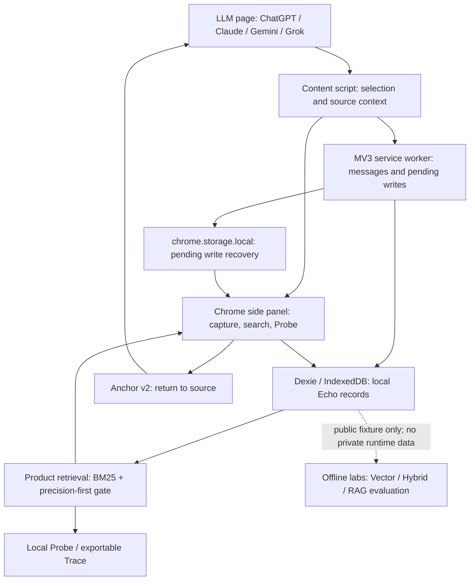

# Echo Architecture Interview Guide / Echo 架构面试资料

> 面向 AI Product Engineer / LLM Application Engineer 面试。
> 这是一份口述材料，不是让你逐字背诵的技术说明书。

## How to use / 怎么用

- 面试官问全局架构：先讲 **60 秒版本**。
- 面试官追问某一层：再进入对应问题。
- 中文回答和英文回答表达的是同一件事，不需要两版都背。
- 所有数字都要带上数据边界，尤其不要把小型 benchmark 说成生产准确率。

## Truth boundary / 先记住这些边界

| 可以说 / Safe claim | 不要说 / Do not claim |
| --- | --- |
| Echo 是可运行的 local-first Chrome extension | Echo 是大规模生产 SaaS |
| 产品主线使用 BM25 + precision-first gate | 产品已经使用 vector、hybrid 或 RAG |
| Vector、hybrid、RAG 都在独立实验中评测 | 实验结果已经证明线上效果 |
| 55 条公开 fixture、40 条标注 query 用于 retrieval 对照 | 这些数据代表真实用户总体 |
| RAG Holdout 是 14 题的一次冻结实验 | RAG 准确率已经被证明是 100% |
| 本地实验的 API cost 是 $0 | 整体计算成本为零 |

---

# 1. High-level architecture / 高层架构

## 人话理解

Echo 不是一个会替用户回答问题的 AI 助手。它更像一个安静的记忆层：用户在 LLM 网页里看到或想到重要内容时，把它存下来；以后遇到相关语境时，Echo 尝试还回一条旧想法。证据不够就不出现。

## 60 秒中文回答

Echo 是一个本地优先的 Chrome 侧边栏，用来捕获和找回 LLM 对话里的重要想法。

整个系统分成四层。第一层是浏览器里的捕获入口，用户在 ChatGPT、Claude、Gemini 或 Grok 页面选择内容。第二层是本地存储，Echo 用 Dexie 和 IndexedDB 保存原文、用户想法、来源和定位信息。第三层是召回，当前产品使用 BM25 加一层 precision-first gate，只有词法证据足够强才展示结果，否则保持沉默。第四层是可靠性与解释，包括 MV3 写入恢复、动态页面锚点、Probe 报告和本地 Trace。

Vector、Hybrid 和 RAG 没有放进产品主线。它们在独立实验目录里使用公开或合成数据评测，这样可以验证 AI engineering 能力，又不会改变 Echo 本地优先、人在回路的产品定位。

## 60-second English answer

Echo is a local-first Chrome side panel for capturing and resurfacing valuable thoughts from LLM conversations.

I think about it in four layers. First, capture happens inside the browser workflow on ChatGPT, Claude, Gemini, or Grok. Second, Dexie and IndexedDB store the selected text, the user's thought, source metadata, and return anchors locally. Third, the production retrieval path uses BM25 with a precision-first gate. It surfaces an Echo only when lexical evidence is strong enough; otherwise silence is a valid result. Fourth, reliability and observability are handled through MV3 write recovery, layered page anchors, Probe reports, and exportable local traces.

Vector, hybrid, and RAG are isolated experiments rather than production features. That lets me evaluate AI approaches without changing Echo's privacy boundary or turning a retrieval product into an answer-generation product.

## Architecture diagram / 架构图

> **边界：** 图里的 Lab 使用 committed public fixture。它不会读取用户的 IndexedDB，也不是扩展的运行时依赖。

---

# 2. Capture & storage / 捕获与存储

## 2.1 Why browser-native? / 为什么做在浏览器里？

### 人话理解

因为用户本来就在浏览器里使用 LLM。让他为了管理一段对话再打开另一个 App，步骤一多，习惯就断了。

### 中文答法

Echo 最早的假设是做一个独立 Collect 工具，让用户保存后再去另一个地方整理。但 dogfood 发现这个入口不成立：用户不会为了管理聊天片段专门打开一个桌面应用。

所以我把捕获和找回都移进浏览器侧边栏。这个变化不是换一个 UI，而是改变了产品闭环：从“先收藏，以后主动整理”变成“在当前工作流里低摩擦捕获，在相关语境里自动找回”。

### English answer

The original hypothesis was a separate Collect-style app where users would manage saved snippets later. Dogfooding showed that the extra entry cost broke the habit. People would not open another desktop app just to organize chat fragments.

Moving Echo into the browser side panel changed the product loop, not just the UI. Capture now happens where the thought is created, and resurfacing happens where the thought may become useful again.

> **别说过头：** 这是 personal dogfood 得出的方向判断，不是正式 A/B test 或大规模用户研究。

## 2.2 Why IndexedDB? / 为什么用 IndexedDB？

### 人话理解

这些记录是结构化的，还会不断增加。IndexedDB 比把所有内容塞进 localStorage 更适合做本地数据库，同时不需要为了面试强行搭云端。

### 中文答法

Echo 需要保存的不只是字符串，还包括原始选区、用户想法、来源 URL、时间、状态和锚点信息。IndexedDB 适合浏览器内的结构化持久化，Dexie 则让查询、更新和 schema 管理更容易。

更重要的是，它符合产品边界：默认情况下，对话记忆不需要上传服务器。代价是数据与当前浏览器 profile 和 extension ID 绑定，所以 Echo 必须提供 JSON 备份导入，并明确提醒用户换机器或重装前导出。

### English answer

An Echo is a structured record, not just a string. It includes the selected passage, the user's own thought, source URL, timestamps, status, and anchor metadata. IndexedDB is a better fit for structured browser persistence, while Dexie gives the application a cleaner query and update layer.

It also supports the product's local-first boundary: conversation memory does not need to be uploaded by default. The trade-off is that storage is tied to the browser profile and extension ID, so backup and ID-based import are part of the architecture rather than an afterthought.

> **别说过头：** IndexedDB 不是跨设备同步，也不会在 extension ID 改变后自动迁移数据。

## 2.3 MV3 write reliability / MV3 写入怎么保证？

### 人话理解

Chrome 的后台 Service Worker 可能随时休眠。不能假设一次写入流程会从头到尾一直活着，所以先把“待办写入”放进一个更容易恢复的本地队列。

### 中文答法

dogfood 中出现过用户补充想法时写入失败。问题不是简单的表单 bug，而是 MV3 Service Worker 生命周期和 Dexie 重连竞态。

现在的做法是先把 pending thought 写入 `chrome.storage.local`，再提交到 Dexie。Dexie 成功后清掉 pending record；如果 Service Worker 中途休眠，已经打开的 Side Panel 或下一次唤醒可以重放这次写入。更新找不到原记录时，还会使用完整记录 `put` 作为恢复路径。

### English answer

Manifest V3 service workers can be suspended, so I do not assume that a multi-step write flow will stay alive. A pending user thought is first parked in `chrome.storage.local`, then committed to Dexie. The pending record is cleared only after success.

If the service worker sleeps or reconnects during the write, the side panel or a later wake-up can replay the pending operation. There is also a full-record `put` fallback when an update cannot see the row during a reconnect race.

> **别说过头：** 这是浏览器内的恢复机制，不等同于分布式事务，也不保证所有设备和所有故障下绝对零丢失。

---

# 3. Retrieval / 召回

## 3.1 Why BM25? / 为什么用 BM25？

### 人话理解

不是因为 BM25 永远最好，而是它现在更符合 Echo：本地、快速、能解释为什么命中，而且可以很严格地控制什么时候不要出现。

### 中文答法

Echo 当前语料规模不大，而且很多重要记录会共享明确的产品词、技术词或连续短语。BM25 能利用词频、语料中的稀有程度和文本长度做排序，同时整个过程可以在浏览器本地运行。

它的另一个优势是可解释。我可以告诉用户是哪些词、哪个字段、哪段连续短语让一条 Echo 被接受。对一个会主动打断用户注意力的产品，这种可调试性很重要。

选择 BM25 不代表否定向量检索。它代表当前产品先使用最符合隐私、延迟和低打扰目标的方案，再通过独立 benchmark 判断是否值得增加复杂度。

### English answer

I did not choose BM25 because it is universally better. I chose it because it currently fits Echo's constraints: a relatively small local corpus, meaningful product and technical terms, browser execution, low latency, and explainable decisions.

BM25 also gives me inspectable evidence: which terms matched, how rare they were in the corpus, which field contributed, and whether a phrase matched. That matters because retrieval can interrupt the user's attention. Vector retrieval remains an experiment, but it has to beat the current product on the metrics that matter before adding complexity.

## 3.2 Why precision-first? / 为什么精度优先？

### 人话理解

搜索框里漏掉一个结果，用户还可以换个词再搜。主动浮现如果经常错，用户会直接把功能关掉。所以对 Echo 来说，错着出现通常比暂时不出现更贵。

### 中文答法

Echo 不是传统搜索结果页，而是主动找回旧想法。如果每次用户选中一个泛词，系统就推十几条“可能相关”的内容，注意力成本会很高，信任也会快速下降。

早期 Probe 审计了 16 份报告、1,493 次候选扫描和 256 个接受结果，其中 139 个接受结果只匹配一个词，250 个没有连续短语证据。这说明旧规则过于宽松。

所以产品明确选择 precision-first：宁可漏掉一些相关 Echo，也减少弱匹配造成的误打扰。`wrong_time` 和 `not_relevant` 也分开，因为“现在不想看”不等于“内容不相关”。

### English answer

Echo is not a conventional search results page. It proactively resurfaces memory, so the cost of a false positive is higher. If generic words trigger a long list of weak matches, users lose trust and disable the feature.

In the early Probe audit, 16 reports contained 1,493 candidate scans and 256 accepted candidates. Of those accepts, 139 matched only one term and 250 had no phrase evidence. That pushed the product toward precision-first retrieval: accept some misses in exchange for fewer interruptions.

## 3.3 How does the gate work? / Gate 怎么工作？

### 人话理解

BM25 先负责“看起来有多像”，gate 再负责“证据够不够让我打扰用户”。分数高不等于一定展示。

### 中文答法

召回先对中英文文本做分词，再按 corpus frequency 给词分层。每个字段计算 BM25，连续短语会得到额外证据，不同字段也有不同权重。

然后 gate 做产品判断：完全没有有效词、当前来源自身、重复内容或只有弱单词关系的候选会被拒绝。展示通常需要更强的连续短语或多个有效词证据，最后再限制返回数量。

Probe ledger 会保留接受和拒绝原因，所以调 gate 时不是凭感觉改一个神秘阈值，而是能看到 false positive 到底来自泛词、字段权重、短语缺失还是重复结果。

### English answer

BM25 ranks lexical similarity, but the gate decides whether the evidence is strong enough to spend user attention. The pipeline tokenizes Chinese and English text, assigns frequency tiers from the corpus, scores multiple fields with BM25, applies field weights, and adds phrase evidence.

The product gate then rejects cases such as no meaningful overlap, exact-source matches, duplicates, or weak single-term connections. Surfacing normally requires a stronger phrase or multi-term signal, and the final result count is capped. The Probe ledger preserves both acceptance and rejection reasons, so tuning remains evidence-driven.

> **别说过头：** Gate 的输出是可解释的产品规则，不是经过概率校准的“置信度”。

## 3.4 Why silence? / 为什么沉默也是结果？

### 人话理解

系统不知道时，最诚实的输出就是不打扰。

### 中文答法

Echo 的核心价值不是每次都返回内容，而是在合适时机还回真正有用的旧想法。如果证据不足仍然强行展示，产品只是把记忆问题变成了噪声问题。

所以 abstention 不是异常路径，而是一等产品行为。我们在 benchmark 里专门标注 `surface` 和 `abstain` query，也单独衡量 false surfaces 和 abstention accuracy，而不是只看 recall。

### English answer

Echo's job is not to return something every time. Its job is to return a useful old thought at the right moment. When evidence is weak, forcing a result turns a memory problem into a noise problem.

That makes abstention a first-class product behavior. The benchmark explicitly labels both `surface` and `abstain` queries and measures false surfaces and abstention accuracy, not recall alone.

---

# 4. Evaluation / 评测

## 4.1 What is the benchmark? / Benchmark 是什么？

### 人话理解

就是给不同召回方案同一套“考卷”：同样的记录、同样的问题、提前标好的正确答案和容易混淆的错误答案。

### 中文答法

主 retrieval benchmark 使用固定的 55 条公开 fixture Echo 和 40 条人工标注 query。每个 query 包含 relevant IDs、hard negatives，以及正确行为应该是展示还是沉默。

BM25、raw vector 和 hybrid 在同一份 corpus 和 label 上运行。我们比较 P@3、R@3、MRR、每 100 次 query 的 false surfaces、abstention accuracy 和延迟。

这套数据来自真实产品主题并尽量模拟 dogfood 场景，但它是公开 constructed fixture，不是私人 IndexedDB 导出，也不是生产用户数据。

### English answer

The retrieval benchmark is a fixed exam for every strategy: the same 55-record public fixture, the same 40 annotated queries, and the same relevance labels. Each query includes relevant records, hard negatives, and whether the correct behavior is to surface or abstain.

BM25, raw vector, and hybrid run against the same corpus. I compare P@3, R@3, MRR, false surfaces per 100 queries, abstention accuracy, and latency. The fixture is dogfood-realistic but constructed, so I do not present it as production-user evidence.

## 4.2 Why Dev / Holdout? / 为什么拆 Dev 和 Holdout？

### 人话理解

如果一边看答案一边改规则，最后考得再高也不能说明能处理新问题。Dev 用来练习和修正，Holdout 留到最后只考一次。

### 中文答法

Dev set 用来发现问题、调整 prompt、解析器和 evaluator。Holdout 在这个过程中保持冻结，等检索规则、generation prompt 和评分方式都确定后再运行一次。

RAG Lab 使用了 6 道 Dev 题和 14 道 frozen Holdout 题。正式运行前，我们把 prompt、scorer、retriever、corpus 和 Holdout 文件写进 SHA-256 freeze manifest，并在 Git 中先提交冻结版本。运行后 Holdout 就被视为已经用过，不能继续拿它调 v1。

### English answer

The Dev set is for finding mistakes and changing the prompt, parser, or evaluator. The Holdout stays frozen until those choices are fixed, then it is run once.

In the RAG Lab, I used six Dev questions and a fourteen-question frozen Holdout. Before the scored run, the prompt, scorer, retriever, corpus, and Holdout file were recorded in a SHA-256 freeze manifest and committed to Git. After the run, that Holdout was considered spent and could not be used to tune v1.

## 4.3 Why vector? / 为什么还要做向量实验？

### 人话理解

BM25 擅长“用词相近”，但可能漏掉“意思一样、说法不同”。向量实验是为了测这个缺口到底有多大，不是为了给项目强行加 AI。

### 中文答法

BM25 的已知弱点是 paraphrase 和跨语言表达。例如旧记录与当前 query 意思接近，但几乎不共享字面词，词法召回可能保持沉默。

所以我做了隔离的 vector 和 hybrid 对照，验证语义候选能补回多少 recall，同时观察它带来多少 hard negatives、false surfaces、模型体积和运行成本。实验的目标是支持 ship / no-ship 决策，而不是证明向量一定更先进。

### English answer

BM25 has a known weakness: paraphrases and cross-language queries may express the same idea with little lexical overlap. The vector experiment measures how much semantic retrieval can recover and what it costs in false positives, hard-negative exposure, model weight, and runtime complexity.

The point was to support a ship or no-ship decision, not to assume that vector retrieval is more advanced and therefore belongs in the product.

## 4.4 What failed? / 什么失败了？

### 人话理解

向量确实找回了更多“意思相近”的内容，但也太爱给答案，尤其不知道什么时候闭嘴。Hybrid 好一点，但还没好到值得上线。

### 中文答法

在 55 条 Echo、40 条 query 的 constructed fixture 上：

| Strategy | P@3 | R@3 | False surfaces /100 | Abstention accuracy |
| --- | ---: | ---: | ---: | ---: |
| Product BM25 + gate | 28.7% | 25.8% | **5.0** | **80%** |
| Raw vector top-3 | 32.5% | **76.3%** | 17.5 | 0% |
| Hybrid | 25.0% | 59.6% | 7.5 | 60% |

Raw vector 的 recall 明显更高，说明语义检索确实能补 paraphrase。但它在 abstain query 上完全不会沉默，false surfaces 从 BM25 的 5.0 上升到 17.5。Hybrid 降低了一部分噪声，但 false surfaces 和 abstention 仍没有超过产品 BM25。

失败的不是“向量完全没用”，而是“直接把向量接进 Echo 就会更好”这个假设没有成立。

### English answer

On the constructed 55-record, 40-query fixture, raw vector retrieval raised R@3 from 25.8% to 76.3%, so it clearly recovered paraphrases. But false surfaces increased from 5.0 to 17.5 per 100 queries, and abstention accuracy fell from 80% to 0%.

Hybrid recovered some quietness, but it still produced 7.5 false surfaces per 100 queries and only 60% abstention accuracy. The failed assumption was not that vectors have no value. It was that adding vector retrieval directly would automatically improve Echo's product experience.

## 4.5 Why not ship? / 为什么不上线？

### 人话理解

实验优化的是“多找回来”，产品在乎的是“别乱打扰”。评价标准没赢，就不该因为简历好看而上线。

### 中文答法

Echo 的主要风险不是结果列表少，而是主动浮现错误内容。Vector 和 hybrid 提高了 recall，却没有在 false surfaces 和 abstention 上超过现有产品 gate。

同时，浏览器端 embedding 还会增加模型下载、冷启动、内存和维护成本。既然产品收益没有被当前证据证明，我选择把它留在实验层。这个 no-ship 决定本身就是实验结果，而不是功能没做完。

### English answer

Echo's main risk is not returning too few search results. It is proactively interrupting the user with the wrong memory. Vector and hybrid improved recall, but neither beat the product gate on false surfaces and abstention.

Browser-side embeddings would also add model download, cold-start, memory, and maintenance cost. Since the product benefit was not demonstrated, I kept them in the evaluation layer. The no-ship decision is the result of the experiment, not unfinished implementation.

---

# 5. RAG Lab / 独立 RAG 实验

## 5.1 Why separate? / 为什么单独做？

### 人话理解

Echo 的产品任务是“找回我的旧想法”，RAG 的任务是“根据资料生成答案”。两者相关，但不是同一个产品。为了面试强行合并，反而会破坏原来的逻辑。

### 中文答法

RAG Lab 被放在独立 experiment 目录，生产扩展不依赖它。它只读取 committed public fixture，不访问私人 Echo、IndexedDB 或 dogfood export。

这样做有两个原因。产品上，Echo 仍然是 local-first retrieval layer，不替用户生成结论。工程上，我仍然可以展示 retrieval、grounded generation、citations、abstention、evaluation、latency 和 cost estimation，而不制造一个没有被用户需求验证的功能。

### English answer

The RAG Lab lives in an isolated experiment directory, and the production extension does not depend on it. It reads only the committed public fixture and never accesses private Echo data or browser IndexedDB.

That separation protects both stories. Echo remains a local-first retrieval layer that resurfaces the user's own thoughts, while the Lab demonstrates retrieval, grounded generation, citations, abstention, evaluation, latency, and cost estimation without inventing an unvalidated product feature.

## 5.2 What are you evaluating? / RAG Lab 评什么？

### 人话理解

不只是看模型“答得像不像”，而是拆开看：资料有没有找对、答案有没有乱说、引用是不是真的支持、该拒答时会不会拒答、速度和成本是多少。

### 中文答法

RAG Lab 对比两个条件：`no-context` 只给问题，不给资料；`candidate-bm25-rag` 给模型 Candidate BM25 的 Top-5 证据。

评测分成几层：

1. Retrieval 是否找到 required evidence，是否暴露 hard negative；
2. 模型是回答还是 abstain，行为是否符合标签；
3. 每条 claim 是否有 citation，citation ID 是否来自已提供证据；
4. 人工检查 citation 在语义上是否真的支持 claim，以及是否出现 forbidden claim；
5. 记录 token、冷启动、去掉模型加载后的 latency 和 API cost boundary。

### English answer

The Lab compares a `no-context` condition with `candidate-bm25-rag`, where the model receives the top five Candidate BM25 records.

Evaluation is layered. I measure required-evidence retrieval and hard-negative exposure, correct answer-versus-abstain behavior, claim-level citation validity, manual semantic support and forbidden claims, plus tokens, cold start, runtime excluding model load, and the API cost boundary. This avoids collapsing the whole pipeline into a single vague answer-quality score.

## 5.3 How do you test abstention? / 怎么测试拒答？

### 人话理解

故意给模型一些“看起来沾边，但其实不能回答”的资料，看它会不会忍住不编。

### 中文答法

我们设计了 unsupported questions、insufficient evidence 和 hard negatives。例如问 Echo 有多少付费用户、生产环境几千用户下的 p95 latency，或者只给一条提到咖啡但没有烘焙温度的记录。

Candidate retrieval 仍然可能返回相邻资料，所以测试的不是“检索为空才拒答”。真正的要求是：即使 Top-5 有看似相关的内容，只要证据不能支持结论，模型也必须 abstain。

在 frozen Holdout 中，三道 abstention 题都拿到了候选资料，但模型 3/3 正确拒答，没有捏造 embedding 上线情况、生产 SLA、用户规模或咖啡温度。

### English answer

I deliberately use unsupported questions, insufficient evidence, and hard negatives. Examples include asking for Echo's production p95 across thousands of users or asking for a coffee-roasting temperature when the corpus only contains a topic-adjacent coffee note.

Candidate retrieval may still return nearby material, so abstention is not tested only when retrieval is empty. The generator must refuse when the top-five evidence cannot support the requested conclusion. On the frozen Holdout, all three abstention questions received candidates and all three were correctly refused.

## 5.4 What did the RAG experiment show? / RAG 实验结果是什么？

### 中文答法

在一次冻结的 14 题 public Holdout 上，No Context 只答对了 3 道需要拒答的问题，也就是 3/14。Candidate BM25 RAG 的 answer / abstain 行为是 14/14 正确；11 道可回答题都回答，3 道不可回答题都拒答。生成的 16 条 factual claims 经人工检查都有 citation 支撑，没有发现 forbidden claim。

但这个结果不能叫“RAG 准确率 100%”。样本只有 14 题，Wilson 95% interval 大约是 78.5% 到 100%；其中 7 题只需要单条证据，语料也只有 55 条，措辞相对直接。H07 和 H09 虽然 grounded，但各漏掉了一个预期要点。

### English answer

On one frozen fourteen-question public Holdout, the no-context condition got only the three abstention questions right, or 3 out of 14. Candidate BM25 RAG produced the correct answer-or-abstain behavior on all 14 questions: 11 answers and 3 refusals. Manual review found that all 16 factual claims were supported by their citations, with no forbidden claim observed.

I do not describe that as proven 100% RAG accuracy. The sample contains only fourteen questions, giving a Wilson 95% interval of roughly 78.5% to 100%. Seven questions require only one evidence record, the corpus contains only 55 records, and two grounded answers were incomplete.

## 5.5 Why isn't generation in Echo? / 为什么 Echo 本体没有 generation？

### 人话理解

用户想找回的是自己原来的判断，不是让模型把它改写成一个听起来更确定的新答案。

### 中文答法

Echo 当前解决的是 memory resurfacing，不是 question answering。直接展示原始 Echo 和来源，更容易保留用户当时的语气、时间和决策背景，也让用户自己判断现在是否仍然适用。

Generation 会增加新的风险：模型可能把几条旧记录合成一个用户从没做过的结论，citation 也可能形式合法但语义支撑不足。它还需要模型运行成本，并可能改变本地隐私边界。

因此我先把 generation 留在 Lab。除非未来真实用户任务证明“基于多个 Echo 生成有引用的答案”比直接 resurfacing 更有价值，并且隐私、faithfulness、abstention 和延迟都达标，否则没有理由接入主产品。

### English answer

Echo currently solves memory resurfacing, not question answering. Showing the original thought and its source preserves the user's wording, timing, and decision context, then lets the human decide whether it still applies.

Generation introduces a different risk: the model may combine old records into a conclusion the user never made, and a syntactically valid citation may still fail to support a claim. It also adds model runtime and may change the privacy boundary. I would ship generation only if a validated user task shows that cited synthesis is more useful than direct resurfacing and it passes faithfulness, abstention, privacy, and latency requirements.

---

# Quick numbers / 数据速查

## Product retrieval benchmark

| 数据 | 数值 |
| --- | ---: |
| Public fixture corpus | 55 Echoes |
| Annotated retrieval queries | 40 |
| BM25 false surfaces /100 | **5.0** |
| Raw vector false surfaces /100 | 17.5 |
| Hybrid false surfaces /100 | 7.5 |
| BM25 abstention accuracy | **80%** |
| Raw vector abstention accuracy | 0% |
| Hybrid abstention accuracy | 60% |

## RAG evaluation

| 数据 | 数值 |
| --- | ---: |
| Dev questions | 6 |
| Frozen Holdout questions | 14 |
| No Context behavior correctness | 3/14 |
| Candidate BM25 RAG behavior correctness | 14/14 |
| Correct Holdout abstentions | 3/3 |
| Manually grounded factual claims | 16/16 |
| Holdout Wilson 95% interval | about 78.5%-100% |

---

# Three-minute story / 三分钟项目故事

## 中文版

Echo 是一个本地优先的 Chrome 侧边栏，用来把 LLM 对话中的重要想法在未来相关语境里重新找回来。

项目最初是独立 Collect App，但 dogfood 发现用户不会为了整理聊天片段专门打开另一个应用，所以我把捕获和找回都移进浏览器工作流。这也改变了产品目标：不是存更多，而是安静地还回一条有用的旧想法。

第一版词法召回会被中文泛词触发。我没有直接加 embedding，而是先增加 Probe ledger，审计了 16 份报告、1,493 次候选扫描和 256 个接受结果。数据表明大部分接受缺少短语证据，于是我收紧成 BM25 + precision-first gate，让沉默成为合法结果。

之后我建立了一个 55 条 Echo、40 条 query 的离线 benchmark，对比 BM25、vector 和 hybrid。Vector 的 recall 更高，但 false surfaces 从 5.0 增加到 17.5，abstention accuracy 从 80% 降到 0%。Hybrid 有改善，但仍没有超过产品 gate，所以我没有把它上线。

为了证明 grounded generation 和评测能力，我又建立了完全隔离的 RAG Lab，只使用公开 fixture。冻结 prompt、retriever 和 evaluator 后只运行一次 14 题 Holdout。Candidate BM25 RAG 的 answer / abstain 行为是 14/14 正确，三道陷阱题全部拒答，16 条 factual claims 经人工检查都有 citation 支撑。但样本很小，所以我不会把它包装成生产准确率。

这个项目最想证明的不是我加了多少 AI 功能，而是我能从用户问题出发，建立可解释的系统和评测，并在证据不支持时做出 no-ship 决定。

## English version

Echo is a local-first Chrome side panel that resurfaces valuable thoughts from LLM conversations when they become relevant again.

The project started as a separate Collect app, but dogfooding showed that users would not open another application just to manage chat fragments. I moved capture and recall into the browser workflow, which changed the product goal from saving more content to quietly returning one useful old thought.

The first lexical retriever over-fired on generic Chinese terms. Instead of immediately adding embeddings, I built a Probe ledger and audited 16 reports, 1,493 candidate scans, and 256 accepts. Most accepted candidates lacked phrase evidence, so I tightened the system into BM25 plus a precision-first gate where silence is a valid result.

I then built an offline benchmark with 55 fixture Echoes and 40 annotated queries to compare BM25, vector, and hybrid retrieval. Vector recall improved, but false surfaces rose from 5.0 to 17.5 per 100 queries and abstention accuracy fell from 80% to zero. Hybrid recovered some quietness but still did not beat the product gate, so I did not ship it.

To demonstrate grounded generation and evaluation separately, I built an isolated RAG Lab using only public fixtures. After freezing the prompt, retriever, and evaluator, I ran a fourteen-question Holdout once. Candidate BM25 RAG produced the correct answer-or-abstain behavior on all fourteen questions, refused all three traps, and all sixteen factual claims were manually supported by citations. The sample is small, so I do not present it as production accuracy.

The strongest evidence in this project is not the number of AI features. It is the ability to connect a user problem to an explainable system, evaluate alternatives, and make a no-ship decision when the evidence is not strong enough.

---

# Final interview reminders / 最后提醒

1. 先讲用户为什么需要它，再讲 BM25、IndexedDB 或 RAG。
2. 不要说“BM25 比 vector 好”，要说“BM25 当前更符合 Echo 的目标指标”。
3. 不要说“RAG 100% 准确”，要说“在一次冻结的 14 题 Holdout 上行为 14/14 正确，并说明限制”。
4. 被问到云端和大规模系统时，诚实回答这是 local-first personal alpha，不伪造 production SLA。
5. 面试官问 why not ship 时，不要防御。这个项目最成熟的地方之一，就是有证据地说“不”。
