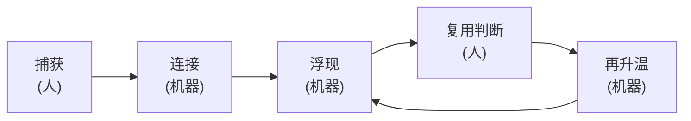
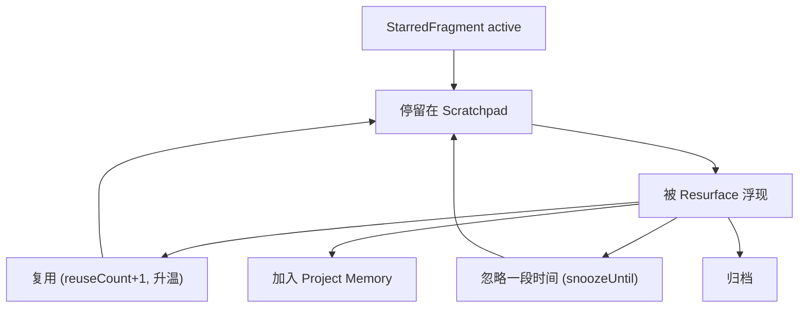
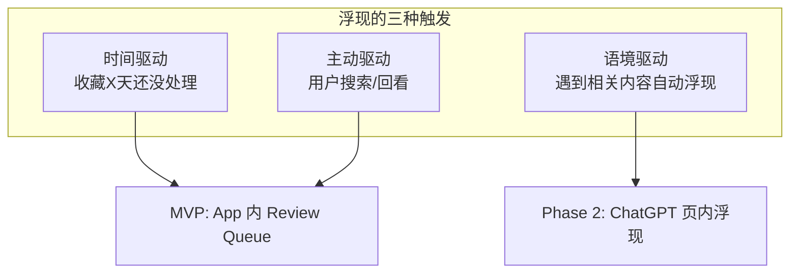
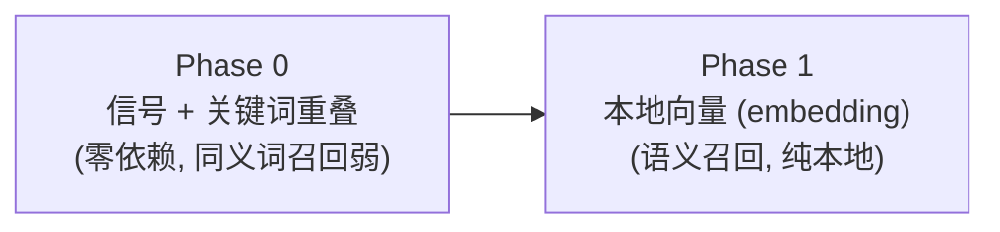
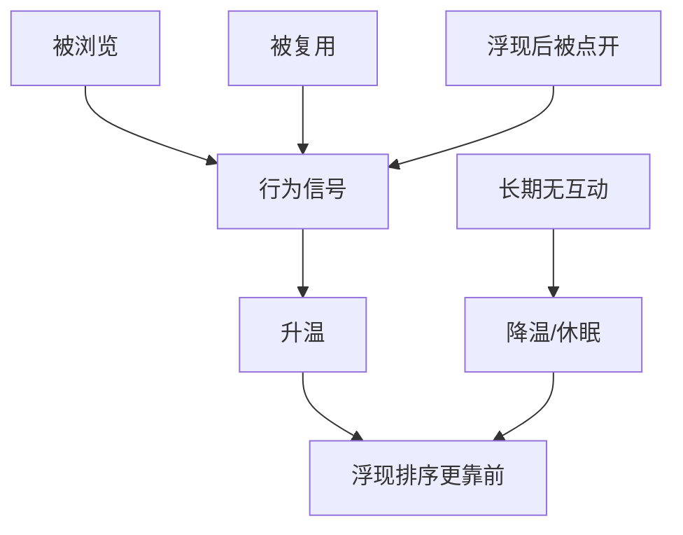
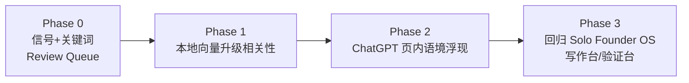

# Memory Layer 设计文档

## 这份文档的定位

回答一个之前一直空着的问题：**记忆怎么"动起来"。**

和已有文档分工：

- `memory-theory.md` 回答**为什么**（学术地基：Memex、取回线索、扩散激活）
- `memory-schema.md` 回答**存什么**（对象与字段）
- 本文档回答**怎么动**（生命周期、浮现机制、相关性、升温）

---

## 1. 定位

> Solo Founder OS 是一层 **Memory Layer（记忆基础设施）**，不是 Agent，也不是 Skill。

| | 它做什么 | 谁决策 | 是不是我们 |
| --- | --- | --- | --- |
| Skill | 一个被调用的能力 | 上层 | 否 |
| Agent | 自己定目标、规划、执行 | AI | 否（明确反对） |
| Memory Layer | 捕获、连接、在对的时机把旧信息还给人 | 永远是人 | 是 |

一句话使命：**在对的语境，把对的旧片段还给你——不是帮你存更多，而是降低"旧想法 × 新语境"撞上的成本。**

---

## 2. 记忆生命周期

整个产品就是这一条闭环。核心原则：**机器做体力活，人只做价值判断。**

| 环节 | 谁做 | 说明 |
| --- | --- | --- |
| 捕获 | 人 | 低摩擦收藏，保住原文与来源 |
| 连接 | 机器 | 算相关、找重复、按关键词/向量聚拢 |
| 浮现 | 机器 | 在对的时机把旧片段重新推到面前 |
| 复用判断 | 人 | 这条还有没有用、要不要复用/沉淀 |
| 再升温 | 机器 | 根据人的行为信号调整权重 |

之前卡住的根因：旧设计把"连接"和"判断"塞进同一个手动动作（promote），太重，所以人躺平。本设计把两者拆开。

---

## 3. 对象与状态

复用 `memory-schema.md` 的四个对象（`Project` / `StarredFragment` / `Scratchpad` 视图 / `ProjectMemory`），本设计在 `StarredFragment` 上**新增三个字段**支撑浮现：

| 新增字段 | 作用 |
| --- | --- |
| `lastSurfacedAt` | 上次被浮现的时间，避免短期反复浮现 |
| `snoozeUntil` | 用户"忽略一段时间"，到期前不再浮现 |
| `embeddingJson` | 本地向量，用于语义相关（Phase 1 引入） |

状态流转（在原 schema 基础上补入"浮现"与"休眠"）：

---

## 4. 浮现机制 Resurface（重头）

### 三种触发模式

- 时间驱动、主动驱动：实现简单，**MVP 先做**（App 内 Review Queue）。
- 语境驱动：是真正的差异点，但风险高（打扰），留到 **Phase 2**。

### MVP 浮现 = App 内 Review Queue

打开 review 页面时，顶部自动浮出 3-5 条值得重看的旧片段，每条配一句 `why surfaced`。

打分维度（每条命中即作为浮现理由）：

| 维度 | 理由文案示例 |
| --- | --- |
| 收藏超 N 天且从未复用 | "收藏 X 天还没处理" |
| 有备注但未沉淀 | "你给它写过备注" |
| 曾被复用 | "你之前复用过这条" |
| 与最近收藏相似（向量） | "和你最近收藏的 N 条相似" |

### 不打扰原则（ADHD 敏感点）

- 每条浮现后写入 `lastSurfacedAt`，短期不重复浮现。
- 用户可"忽略一段时间"（`snoozeUntil`），到期前不再出现。
- 数量克制：一次只浮 3-5 条，不堆砌。

---

## 5. 相关性计算

界面与打分框架不变，**只替换"算相关"这一个函数**，可平滑升级。

### 关于本地向量（写进文档，免得忘）

- **是什么**：把文字变成一串数字（向量），意思相近 → 数字相近。能抓"同一个意思"，不只是"同一个词"。
- **本地**：模型跑在自己电脑上，文字不外发，符合纯本地原则。代价是首次下载模型文件（约 100–500MB）+ 一个 Python 包。
- **怎么跑**：收藏时算一次向量存进 SQLite；要找相关时用 numpy 算余弦相似度。个人规模（几百到几千条）无需向量数据库。
- **选型**：常写中英混合，选多语言小模型（如 `multilingual-e5-small`），实现时定。

---

## 6. 升温 / 降温（解决"懒得 promote"）

关键决策：**不再依赖手动 promote。** `Project Memory` 不是"你搬上去"的，而是"沉淀出来"的。

- 升温纯机器、用户无感。
- Human in the loop 体现在"**随时可否决/钉住/忽略**"，而不是"必须主动搬运"。
- 重要性的更优衡量可能不是"热度（看得多）"，而是"被多少不同语境激活过"（见 `memory-theory.md`）——这点 MVP 先观察，不急着实现。

---

## 7. 边界与隐私

- 纯本地：FastAPI + SQLite，数据不出本机。
- 不做：云同步、移动端、ChatGPT 页内实时提醒（Phase 2）、后台自治 agent、自动删除/合并。

---

## 8. 验证标准

自用 1-2 周观察：

- 浮出来的片段有没有被点开 / 复用
- 本地向量相比关键词，召回是否明显更好
- 浮现频率会不会打扰

通过标准：

- review 页面能稳定浮出 3-5 条带理由的旧片段
- 至少有几条因浮现被重新复用或沉淀
- 你愿意持续打开 review 页面看回看面板

---

## 9. 分阶段

当前只做 Phase 0 → Phase 1。Phase 2/3 等链路验证有价值后再说。
