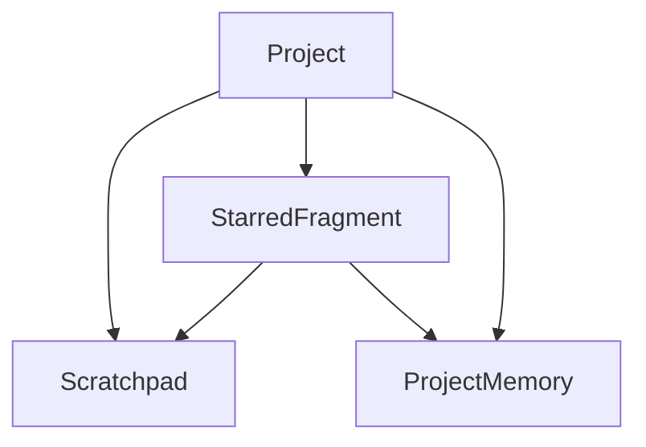
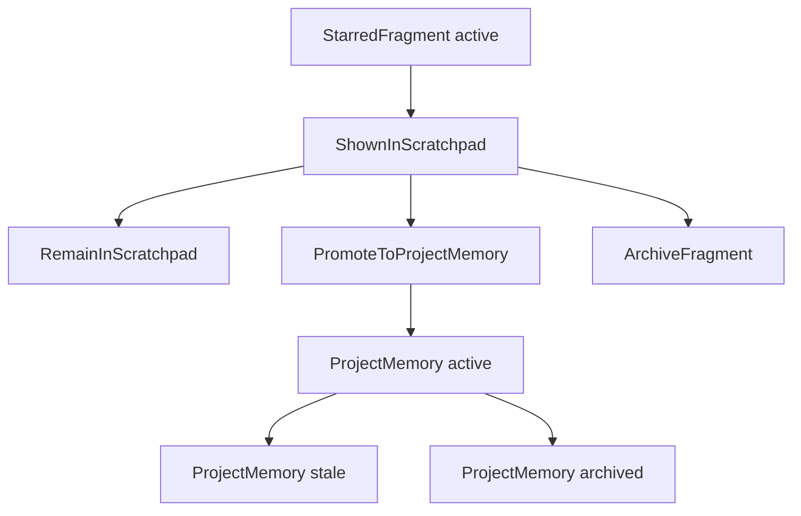

# Memory Schema

## 文档目的

这份文档用于定义 `Solo Founder OS` 第一版真正进入代码的最小对象模型。

目标不是一次性覆盖完整 OS，而是只保留足够支撑第一条黄金路径的对象：

- `Project`
- `StarredFragment`
- `Scratchpad`
- `ProjectMemory`

这四个对象足以支撑：

1. 在某个项目中看到一段重要内容
2. 一键收藏
3. 补一句备注
4. 之后按项目找回
5. 决定是否沉淀为正式记忆

## 设计原则

- 第一版优先保存原始片段，而不是生成抽象总结。
- 第一版优先保留项目边界，避免信息串台。
- 第一版优先支持手动判断，不追求复杂自动升级。
- 第一版字段尽量少，但必须保住来源、时间、项目和原文。

## 对象总览

## 1. Project

`Project` 是第一版最重要的上下文边界。

### 作用

- 承载一个明确主题、客户、产品或写作任务
- 限定片段、临时内容和正式记忆的默认作用域
- 作为第一版默认检索单位

### 最小字段

| 字段            | 类型       | 必填  | 说明                    |
| ------------- | -------- | --- | --------------------- |
| `id`          | string   | 是   | 项目标识                  |
| `name`        | string   | 是   | 项目名称                  |
| `description` | string   | 否   | 项目说明，帮助用户区分项目         |
| `status`      | enum     | 是   | `active` / `archived` |
| `createdAt`   | datetime | 是   | 创建时间                  |
| `updatedAt`   | datetime | 是   | 最后更新时间                |

### 第一版规则

- 默认所有收藏和记忆都必须归属于某个 `Project`
- 默认只在当前 `Project` 内检索
- 不做跨项目自动联动

## 2. StarredFragment

`StarredFragment` 是第一版最核心的对象。

它代表“用户明确觉得重要、需要先保留下来的原始片段”。

### 为什么单独建模

- `Star` 是动作，`StarredFragment` 是动作产生的记录
- 它不是正式记忆，也不是 AI 总结
- 它的目标是保住原文和语境，避免灵机一动被抹平

### 最小字段

| 字段            | 类型       | 必填  | 说明                                          |
| ------------- | -------- | --- | ------------------------------------------- |
| `id`          | string   | 是   | 片段标识                                        |
| `projectId`   | string   | 是   | 所属项目                                        |
| `content`     | text     | 是   | 原始片段正文                                      |
| `sourceType`  | enum     | 是   | `manual` / `chat` / `doc` / `web` / `other` |
| `sourceLabel` | string   | 否   | 来源标题，如页面名、对话名、文档名                           |
| `sourceUri`   | string   | 否   | 来源链接或定位信息                                   |
| `capturedAt`  | datetime | 是   | 被收藏的时间                                      |
| `annotation`  | text     | 否   | 用户补充备注                                      |
| `tags`        | string[] | 否   | 用户手动添加的标签                                   |
| `status`      | enum     | 是   | `active` / `archived` / `promoted`          |

### 第一版规则

- `content` 必须优先保存原文
- `annotation` 应保持可选，不能强迫用户每次都写
- `capturedAt` 必须清晰保留，因为时间感对找回非常关键
- 第一版不要求 AI 自动分类后才能保存

## 3. Scratchpad

`Scratchpad` 是项目内的临时容器，用来承接还没有资格进入正式记忆的内容。

在第一版里，它更像一种“视图和状态层”，而不是独立复杂实体。

### 作用

- 聚合项目内所有待整理的重要片段
- 支持用户之后集中回看、再决定是否沉淀
- 承接“先保存，后判断”的真实行为

### 建模方式

第一版可以把 `Scratchpad` 设计成 `Project` 下的默认容器，不一定需要复杂独立表。

如果需要显式建模，最小字段可以是：

| 字段          | 类型       | 必填  | 说明                  |
| ----------- | -------- | --- | ------------------- |
| `id`        | string   | 是   | 容器标识                |
| `projectId` | string   | 是   | 所属项目                |
| `name`      | string   | 是   | 默认可固定为 `Scratchpad` |
| `createdAt` | datetime | 是   | 创建时间                |
| `updatedAt` | datetime | 是   | 最后更新时间              |

### 第一版规则

- `Scratchpad` 默认接纳新的 `StarredFragment`
- `Scratchpad` 不等于正式长期记忆
- `Scratchpad` 允许内容长期停留，不强制整理
- `Scratchpad` 在行为上应被视为高频主工作区，而不是临时垃圾桶

## 4. ProjectMemory

`ProjectMemory` 是项目内正式沉淀后的长期记忆。

它和 `StarredFragment` 的区别是：

- `StarredFragment` 先保住原文
- `ProjectMemory` 表示这条内容已经被用户判断为值得长期保留

### 最小字段

| 字段                 | 类型       | 必填  | 说明                              |
| ------------------ | -------- | --- | ------------------------------- |
| `id`               | string   | 是   | 记忆标识                            |
| `projectId`        | string   | 是   | 所属项目                            |
| `title`            | string   | 否   | 便于回看的简短标题                       |
| `content`          | text     | 是   | 记忆正文，可来自原文或轻微整理后的文本             |
| `sourceFragmentId` | string   | 否   | 若由 `StarredFragment` 提升而来，记录来源  |
| `sourceType`       | enum     | 是   | 主要来源类型                          |
| `sourceLabel`      | string   | 否   | 来源标题                            |
| `sourceUri`        | string   | 否   | 来源链接或定位信息                       |
| `capturedAt`       | datetime | 是   | 原始内容被捕获时间                       |
| `promotedAt`       | datetime | 是   | 被沉淀为正式记忆的时间                     |
| `annotation`       | text     | 否   | 用户判断或上下文备注                      |
| `status`           | enum     | 是   | `active` / `stale` / `archived` |

### 第一版规则

- `ProjectMemory` 必须可追溯到来源
- `ProjectMemory` 不应保存“纯模型猜测”
- 对时效性内容允许后续标记为 `stale`
- 第一版不做复杂冲突合并，只保留最小追溯能力
- `ProjectMemory` 更适合作为低频沉淀层，而不是每次收藏后的立即下一步

## 对象关系

### Project -> StarredFragment

一个项目可以有多条已收藏片段。

### Project -> Scratchpad

每个项目默认有一个 `Scratchpad` 视图，用来聚合待整理内容。

### StarredFragment -> ProjectMemory

一条片段在被用户确认后，可以提升为正式记忆。

第一版不要求“一条片段只能产生一条记忆”，但默认先按一对一理解。

同时要注意：

- 这种提升不应被默认理解为高频动作
- 更合理的发生时机是回看、复用、项目整理或系统建议之后

## 状态流转

## 第一版暂不进入代码的概念

这些概念会继续保留在文档层，但不建议进入第一版实现：

- `GlobalConsensus`
- `CandidateInbox`
- 自动共识升级
- 跨项目记忆联动
- 风格偏好建模
- 自动网页抓取
- 多模型编排

原因不是它们不重要，而是它们会显著提高系统复杂度，削弱第一版对“收藏 -> 找回 -> 沉淀”的验证力度。

## 最小实现建议

如果只为了支撑第一版，数据上只需要先回答这些问题：

- 这条内容属于哪个项目
- 原文是什么
- 来源是什么
- 什么时候保存的
- 用户有没有补充备注
- 它现在只是收藏片段，还是已经成为正式记忆

只要这几个问题能稳定回答，第一版就已经具备验证价值。

## 当前结论

第一版不是在实现“完整记忆系统”，而是在实现一个足够可信的最小记忆动作：

先把重要片段保住，再决定它是否值得长期留下。