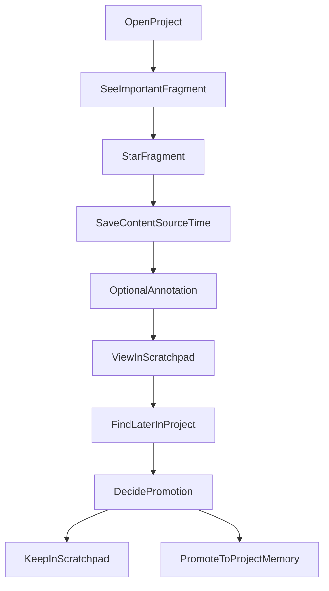

# MVP User Flows

## 文档目的

这份文档定义 `Solo Founder OS` 第一版必须跑通的最小用户流程。

第一版只验证一条黄金路径：

`收藏片段 -> 补充标注 -> 项目内找回 -> 决定是否沉淀为正式记忆`

如果这条路径不能稳定成立，后续的共识层、写作台、验证台都不该优先进入开发。

## MVP 原则

- 只做项目内闭环，不做跨项目联动
- 只做原始片段保存，不做复杂自动抽象
- 只做最小人工判断，不做复杂 AI 自治
- 只做“我以后能找回来”，不做“系统替我思考完成”

## 核心参与对象

- `Project`
- `StarredFragment`
- `Scratchpad`
- `ProjectMemory`

## 黄金路径

## Flow 1: 创建或进入项目

### 目标

先建立清晰上下文边界，避免片段无处可归。

### 用户动作

1. 用户进入项目列表
2. 选择已有项目，或创建新项目
3. 进入该项目工作区

### 系统行为

- 显示当前项目名称和基础说明
- 之后所有片段保存都默认挂到当前项目

### 验证问题

- 用户是否容易理解“当前所有保存动作都属于这个项目”
- 项目边界是否足够清晰，避免后续串台

## Flow 2: 收藏一条重要片段

### 目标

让用户在看到重要内容时，可以极低摩擦地先保留下来。

### 用户动作

1. 用户在项目内看到一段重要内容
2. 点击 `Star` 或执行快速收藏动作

### 系统行为

自动保存：

- 原始片段正文
- 当前项目
- 收藏时间
- 来源类型
- 来源标题或定位信息

自动保存后，这条内容进入项目的 `Scratchpad`

### 验证问题

- 用户会不会真的频繁执行这个动作
- 这个动作是否比现有的手动摘录更顺手
- 系统是否保住了原始片段，而不是过早改写

## Flow 3: 可选补充标注

### 目标

允许用户在不增加太多负担的前提下，补一句最有价值的判断。

### 用户动作

1. 收藏后立即补一句备注，或之后再补
2. 备注内容可以是自然语言，不强迫结构化

### 常见标注示例

- 这句表达很好
- 这条判断靠谱
- 这段以后可能会用
- 这条要复核
- 这条只适合某类文章

### 系统行为

- 保存标注文本
- 不强迫用户打标签
- 不强迫用户立刻决定是否沉淀

### 验证问题

- 用户是否愿意补一句最小备注
- 自然语言备注是否已足够有用

## Flow 4: 在 Scratchpad 中回看

### 目标

让用户几天后能重新找到自己当时觉得重要的片段。

### 用户动作

1. 用户进入项目的 `Scratchpad`
2. 按时间、关键词或最近收藏回看内容

### 系统展示重点

每条片段至少应显示：

- 原文片段
- 收藏时间
- 来源
- 用户备注

### 验证问题

- 用户是否能快速辨认这条片段是什么
- 时间戳和来源是否足够帮助找回当时语境
- 是否比翻聊天记录、网页历史或 Obsidian 更直接

## Flow 5: 决定是否沉淀为正式记忆

### 目标

把“先保住重要片段”和“再判断是否值得长期保留”分开。

这里要特别强调：

- 这不是收藏后的立即下一步
- 更适合作为低频整理动作发生
- 第一版不应假设用户会频繁主动提升

### 用户动作

1. 用户在回看时发现某条内容值得长期保留
2. 选择提升为 `ProjectMemory`

或：

1. 用户决定暂时不处理
2. 内容继续留在 `Scratchpad`

### 系统行为

如果提升：

- 创建一条 `ProjectMemory`
- 保留来源追溯关系
- 记录提升时间

如果不提升：

- 继续保留在 `Scratchpad`
- 不强制清理
- 不把“未提升”视为失败

### 验证问题

- 用户能否清楚区分“收藏片段”和“正式记忆”
- 是否真的存在一些内容会被长期沉淀
- 用户是否更愿意把 `Scratchpad` 当作主工作区，而不是立刻做正式沉淀

## 第一版页面最小要求

### 1. Projects

只需要：

- 项目列表
- 创建项目
- 进入项目

### 2. Project Workspace

第一版只要两个核心区块就够：

- `Scratchpad`
- `ProjectMemory`

如果页面上还有其他区域，也只应是轻量占位，不应分散主流程。

其中：

- `Scratchpad` 应被当作高频主工作区来设计
- `ProjectMemory` 应被当作低频沉淀区来设计

### 3. Fragment Detail

点击某条片段后，能看到：

- 原文
- 来源
- 时间
- 标注
- 是否提升为记忆

## 第一版不做的流程

这些能力故意不进入第一版：

- 自动网页采集
- 自动从聊天记录批量提取片段
- 自动共识升级
- 跨项目检索
- 多模型写作比较
- 事实核验工作台
- 复杂标签体系
- 自动把标注转成结构化偏好

## 为什么这些先不做

因为第一版的目标不是展示系统很强，而是验证一个最基本的问题：

`这个系统能不能比现有做法更稳地保住重要片段，并让我以后重新找回来。`

如果这个问题都没成立，加再多 AI 都只是在给空流程贴功能。

## 技术决策暂缓原则

在这条黄金路径没验证前，先不要过早决定这些问题：

- 是否需要向量数据库
- 是否需要复杂的 RAG
- 是否需要多模型路由
- 是否需要自动网页采集管道
- 是否需要统一知识图谱

第一版只需要支持：

- 项目存储
- 片段存储
- 备注存储
- 基于项目的基础检索和回看

## 成功信号

如果第一版跑得对，应该能看到这些信号：

- 用户开始频繁收藏片段
- 用户愿意偶尔补一句备注
- 用户几天后仍然会回来查这些内容
- 用户愿意长期把 `Scratchpad` 当作回看入口
- 只有少量内容会逐步沉淀为正式记忆
- 用户感觉这套流程比原来手工摘录更有秩序

## 当前结论

第一版不是“做一个老板 OS”，而是“做一个能稳定承接重要片段的项目内记忆闭环”。

只要这条黄金路径成立，后面的系统才有继续长出来的基础。