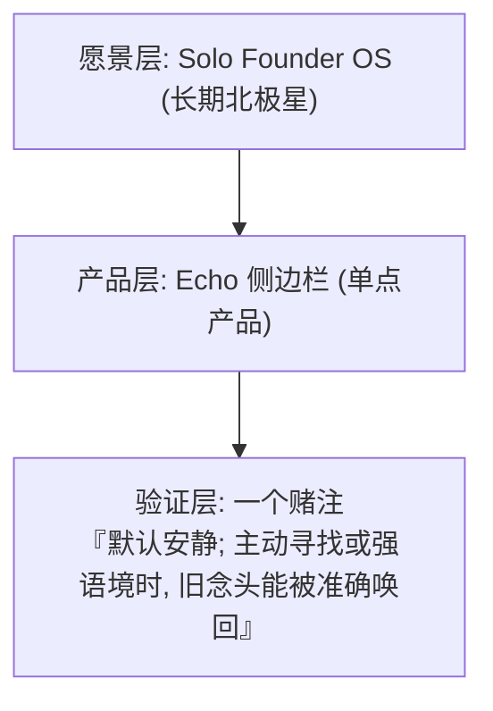
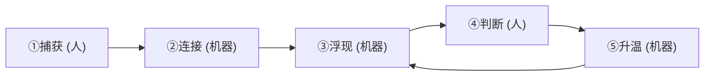

# 产品讨论记录：浏览器里的个人想法浮现工具（多 LLM 场景）

**文件名**：`product-discussion.md`  
**创建日期**：2026-06-19  
**讨论周期**：2026-06-18 晚 ~ 2026-06-19 凌晨；2026-06-19 后续补充；2026-06-25；2026-06-27；**2026-06-28 ~ 2026-07-03（验证期 dogfood、方向调整与安静交互优化，第 16–23 节）**  
**参与者**：用户（产品负责人） + Grok + ChatGPT / Chichi + Cursor  
**目的**：梳理当前产品方向、定位、功能边界与潜在矛盾，方便后续与他人讨论

### 快速目录

**先看这里**：

- [当前导航与状态](#section-0)
- [验证期 dogfood：为什么 Top 3 失败](#section-16)
- [方向调整：低摩擦收集 + 按需唤回](#section-17)
- [长内容收集与原位置锚点](#section-18)
- [今日最终收口：安静与智能如何共存](#section-19)
- [Search v0.2：可解释排序与可见命中](#section-20)
- [小型安全网与 LLM 原位置定位](#section-21)
- [Collect 零打扰与按需补想法](#section-22)
- [Anchor v2：持久消息身份](#section-23)

**完整章节**：

| 章节 | 内容 | 章节 | 内容 |
| --- | --- | --- | --- |
| [第 1 节](#section-1) | 背景与初始状态 | [第 10 节](#section-10) | 自用 Echo 小想法 |
| [第 2 节](#section-2) | 核心痛点演进 | [第 11 节](#section-11) | Collect / Keep / 浮现 |
| [第 3 节](#section-3) | 定位迭代 | [第 12 节](#section-12) | 归档 vs 删除 |
| [第 4 节](#section-4) | 功能需求 | [第 13 节](#section-13) | 被迫记录感与 Pin |
| [第 5 节](#section-5) | 差异化分析 | [第 14 节](#section-14) | 正交数据模型 |
| [第 6 节](#section-6) | 可行性与矛盾 | [第 16 节](#section-16) | Dogfood 完整记录 |
| [第 7 节](#section-7) | 共识与开放问题 | [第 17 节](#section-17) | 方向调整 |
| [第 8 节](#section-8) | 早期定位附录 | [第 18 节](#section-18) | 长内容与锚点 |
| [第 9 节](#section-9) | 收敛到「灵机一动」 | [第 19 节](#section-19) | 当日最终收口 |
| [第 20 节](#section-20) | Search v0.2 | [第 21 节](#section-21) | 草稿、撤销与来源定位 |
| [第 22 节](#section-22) | Collect 零打扰 | [第 23 节](#section-23) | Anchor v2 |

### 讨论时间线索引


| 日期                     | 章节         | 内容摘要                                  |
| ---------------------- | ---------- | ------------------------------------- |
| 2026-06-18 ~ 06-19     | [第 1–9 节](#section-1) | 产品方向、灵机一动收敛、侧边栏 MVP 共识                |
| 2026-06-22             | —          | 仓库归位；Echo 捕获优化（星星反馈、pin）提交            |
| 2026-06-25             | [第 10 节](#section-10)、[第 11 节](#section-11) | 自用小想法；Collect/Keep/浮现双回路原则 |
| 2026-06-25 ~ 06-27     | 代码         | 浮现层 demo（`scoreEcho` v0、回声区）实现        |
| 2026-06-27             | [导航](#section-0)、[第 12–14 节](#section-12) | 归档 vs 删除；被迫记录/Pin；正交模型（仅记录） |
| **2026-06-28 ~ 07-01** | [第 16 节](#section-16) | **验证期数日自用**（浮现 v0 上线后实际使用） |
| **2026-07-01**         | [第 16 节](#section-16) | **同日多轮讨论**：浮现/Pin/链接/长文/稍后归档 → 痛点汇总入档 |
| **2026-07-01**         | [第 17 节](#section-17) | **方向调整**：极致低摩擦收集 + 按需安静唤回 |
| **2026-07-01**         | [第 18 节](#section-18) | **长内容收集**：紧凑卡片、Markdown 与原位置锚点 |
| **2026-07-01**         | [第 19 节](#section-19) | **最终收口**：安静交互与智能唤回共存；最小 Search 已完成 |
| **2026-07-02**         | [第 20 节](#section-20) | **Search v0.2**：可解释关键词排序、可见命中、键盘操作 |
| **2026-07-02**         | [第 21 节](#section-21) | **小型安全网**：Keep 草稿、删除撤销、分站点原位置定位 |
| **2026-07-03**         | [第 22 节](#section-22) | **安静交互优化**：零输入 Collect、卡片补想法、搜索高亮 |
| **2026-07-03**         | [第 23 节](#section-23) | **定位重构**：原生 ID、内容指纹、上下文与虚拟历史加载 |


---


<a id="section-0"></a>

## 0. 导航：你现在在哪（每次打开先看这里）

**建立**：2026-06-27　**最后更新**：2026-07-02

> 主理人 RAM 小，这一节是地图。先看这张，再钻细节。


### 0.1 三层定位（在做的到底是什么）




- 愿景层：不动，长期挂着。
- 产品层：Echo，已独立成型。
- 验证层：**真正在打的仗只有这一个**。先验证主动找回，再验证低打扰的强语境提示。


### 0.2 产品闭环（Echo 本质就这一条环）




| 环节 | 谁做 | 现状 |
| --- | --- | --- |
| ① 捕获 | 人 | 完成并恢复清爽（Collect/Keep + 即时反馈 + 长内容折叠） |
| ② 连接 | 机器 | 冷落评分已移除；强语境连接尚未重做 |
| ③ 唤回 | 人 + 机器 | 最小 Search 已完成；以后再测单条、折叠的强语境提示 |
| ④ 判断 | 人 | 默认无需表态；不再制造稍后/归档/评论作业 |
| ⑤ 升温 | 机器 | 暂缓；不能要求用户维护第二套列表 |

关键：**A 是交互契约（安静、低摩擦），B 是长期能力（连接、补全、唤回）**。二者可以共存。

### 0.3 工程阶段清单（带状态）

```
Phase 0  仓库归位 (collect 归档 / echo 独立)          完成
Phase 1  捕获体验 (零摩擦存 + 反馈 + pin + 折叠)        完成
Phase 2  浮现骨架 (回声区 + scoreEcho v0 + 两回路)      完成
Phase 2.1 Dogfood：冷落 Top 3 未通过                  完成
Phase 2.2 止血：撤掉 Top 3，恢复 Keep + 正常列表         完成
────────────────────────────────────────────────
   ★ 你在这里：Search v0.2 已完成，开始体验主动唤回质量 ★
   （详见第 19 节；先验证 Search，再测强语境提示）
────────────────────────────────────────────────
Phase 3  按需唤回
         ├─ 本地 Search v0.2（排序/命中片段/快捷键） 已完成
         ├─ 链接展示                         待讨论
         └─ 归档可回看                        暂缓
Phase 4  强语境提示（最多一条、默认折叠、无需处理） 验证 Search 后再做
Phase 5  算法精准化（行为/向量）              验证有用后才碰
Phase 6  回归愿景（写作台/验证台/Memory Bridge） 远期
```


### 0.4 收口闸门（贴墙上）

> 任何想加的东西，先问：**「它是在帮助当前思考，还是在要求用户维护系统？」**
>
> - 帮助当前思考，且默认安静 → 才考虑进入 demo。
> - 需要分类、回顾、清队列或维护状态 → 进文档，不进 demo。

辅助问题：**「不做它，会影响我判断唤回有没有价值吗？」** 不影响就先不做。

### 0.5 一句话定位

> Echo 是一个极致轻量的想法捕捉与唤回工具：默认保持安静，在用户主动寻找或当前语境高度相关时，把旧想法重新带回思考现场。


### 0.6 体验后已回答 / 仍开放

1. **主动 vs 被动是假二选一**：确定采用「默认安静，用户主动寻找或强语境时才提示」。
2. **冷落 Top 3**：已移除，不再把打开侧边栏变成复习队列。
3. **知道了 / 已读**：随推送队列一起暂停；默认不要求用户处理卡片。
4. **数据模型重构**：暂缓；字段存在不等于用户负担，先不为抽象整洁迁移数据。
5. **当前验证**：本地 Search 已完成；先体验主动唤回，强语境单条提示排在其后。
6. **仍开放**：链接展示、归档可回看、强语境阈值与效果验证。

---


<a id="section-1"></a>

## 1. 背景与初始状态


### 1.1 项目来源

- 该工具最初是 **Solo Founder OS** 愿景下的一个单点验证工具，定位为「反遗忘 / 二次浮现」工具。
- 最早的核心理念（用户原话）：
  > 「在对的语境，把对的旧片段还给你——不是帮你存更多，而是降低『旧想法 × 新语境』撞上的成本。」
- 设计原则（早期共识）：
  - 机器做体力活（连接、浮现）
  - 人做价值判断（spark）
  - **Scratchpad** 是主工作区
  - **Project Memory** 是低频可选沉淀层


### 1.2 关键早期决策


| 决策   | 内容                              | 原因                              |
| ---- | ------------------------------- | ------------------------------- |
| 形态选择 | 必须走**浏览器侧边栏**方向                 | 用户明确表示：「如果做网页app我根本懒得打开，开局就失败了」 |
| 独立性  | 从 Solo Founder OS 愿景中剥离，独立成单点产品 | 降低认知负担，避免大愿景拖累单点工具的推进           |
| 技术约束 | 本地向量先移出 MVP                     | 降低初期复杂度                         |


**用户明确红线**：这个产品**不能做成上下文/记忆同步工具**（区别于 Mem0、MemoryPlugin 等）。

---


<a id="section-2"></a>

## 2. 核心痛点演进（从模糊到清晰）


### 阶段一：初始痛点

- 「记忆不连续，每个 LLM 都要重新问一遍」


### 阶段二：细化痛点（最终共识）

用户在 6 月 19 日凌晨进一步澄清（原话）：

> 「我打开这个llm问了一遍这个问题，获得了一些有用片段，然后打开另一个llm又问了一次，又获得一些有用片段。我不想在复制问题/追问和有用片段了」

同时他补充道，自己经常遇到「之前跟gemini聊过这个，去搜索根本搜不到」的情况。

**更深层的问题**：

- 用户经常遇到「之前跟 Gemini 聊过这个内容，去搜索根本搜不到」
- 核心矛盾不是「模型不知道我之前说过什么」，而是**「有用片段分散在不同模型对话里，用户不想重复劳动」**

**最终痛点定义**：
在多 LLM 问题探索过程中，有用片段会碎片化，用户希望工具能够**自动收集并在合适语境下浮现**，从而减少重复提问和手动整理的成本。

---


<a id="section-3"></a>

## 3. 定位迭代过程

用户明确表示：「其实对我来说你给的一句话都挺抽象的 但从功能来看应该是1+3」。

因此，后续讨论更倾向于用功能描述 + 定位结合的方式，而不是追求极简的一句话 slogan。

### 3.1 主要迭代版本（精简）

- **早期版本**：多 LLM 问题探索的片段收集与浮现工具
- **中期版本**：浏览器里的轻量个人知识浮现层
- **最终倾向版本（1+3 结合）**：

> **浏览器侧边栏的轻量个人知识浮现工具**。在你使用多个 LLM 时，自动收集不同模型里产生的有用片段，并根据当前语境把之前沉淀的相关想法浮现出来，减少重复提问和手动搜索的成本。


### 3.2 用户对定位的核心诉求

- 要体现「轻」（不是传统重型知识库）
- 要体现「自动浮现」而非用户主动搜索
- 要和「上下文同步工具」保持明显距离
- 要服务于**多 LLM 问题探索 / 交叉验证**场景

---


<a id="section-4"></a>

## 4. 功能需求列表（当前共识）


### 4.1 核心价值

- 在多 LLM 使用场景下，减少用户重复提问和手动整理片段的成本
- 让之前沉淀的有用想法/片段能够被自动连接并浮现，而不是靠用户自己去搜索


### 4.2 收集功能

- 在 LLM 页面（Claude、GPT、Cursor、Grok 等）支持快速收集有用片段
- 支持手动高亮后一键收集，或轻量标记为「值得记住的点」
- 收集粒度以**个人想法碎片**为主（而非整段聊天记录）


### 4.3 浮现功能

- 当用户切换到另一个 LLM 页面时，侧边栏能够根据当前语境**自动浮现**之前相关的片段
- 浮现的片段来自用户在不同模型里的历史沉淀
- 浮现机制以「连接 + 推荐」为主，而非全量上下文注入


### 4.4 交互形态

- 主要通过**浏览器侧边栏**常驻使用（低激活成本）
- 提供轻量的 **review / 浮现查看区**（localhost review 页），用于集中查看和管理浮现内容
- 用户可对浮现的片段进行快速二元/三元判断（spark / 存入 Project Memory / 忽略）


### 4.5 分层设计

- **Scratchpad**：用户当前工作的主空间（临时想法在这里快速碰撞和迭代）
- **Project Memory**：低频沉淀层，只有被用户认可的碎片才会进入


### 4.6 明确不做的边界（红线）

- 不做全量聊天上下文的保存和自动注入（区别于 Mem0 类工具）
- 不做传统重型知识库（用户自己搜索、整理、链接）
- 不强迫用户大量主动存内容
- 不以「模型记忆同步」为核心卖点

---


<a id="section-5"></a>

## 5. 差异化分析


### 5.1 与主要竞品对比


| 维度            | 你的工具（当前方向）        | Mem0 OpenMemory / MemoryPlugin | Constella Sidekick          | Recall (Augmented Browsing) | 你的优势点    |
| ------------- | ----------------- | ------------------------------ | --------------------------- | --------------------------- | -------- |
| **核心定位**      | 轻量个人知识浮现层         | 跨 LLM 记忆/上下文同步层                | 浏览器通用 Second Brain          | 自组织知识库 + 网页增强浮现             | 更轻 + 更聚焦 |
| **内容粒度**      | 个人想法碎片            | 聊天上下文 / 对话总结                   | 笔记 + 网页内容                   | 保存的文章/视频/笔记                 | 碎片级更轻    |
| **主要动作**      | 收集片段 + 语境浮现       | Capture + 自动/半自动注入             | Clip + Auto-connect + Query | 保存 + 知识图谱 + 网页高亮            | 浮现优先     |
| **存储哲学**      | 轻存储，强调浮现          | 存更多上下文来增强记忆                    | 鼓励积累并自动组织                   | 存内容 + 自动建图谱                 | 明显更轻     |
| **人在回路**      | 明确让人做 spark 判断    | 偏自动化注入                         | 部分自动化                       | 部分自动化                       | 更尊重用户判断  |
| **核心场景**      | 多 LLM 问题探索 + 片段浮现 | 让模型记住你说过什么                     | 通用网页 + 知识管理                 | 网页浏览时浮现已保存内容                | 场景更具体    |
| **与上下文工具的区别** | 明确切割              | 核心就是上下文同步                      | 不相关                         | 不相关                         | 差异明显     |


### 5.2 核心差异化一句话总结

> 它们在做「存 + 同步/注入」，你在做「轻收集 + 自动浮现 + 人做判断」。

---


<a id="section-6"></a>

## 6. 可行性分析与矛盾点


### 6.1 主要矛盾 / 张力点


| 矛盾点                        | 详细描述                               | 潜在风险                       | 严重程度 | 建议处理方向                     |
| -------------------------- | ---------------------------------- | -------------------------- | ---- | -------------------------- |
| **自动浮现 vs 人做判断**           | 既希望工具能自动浮现，又强调人必须做最终判断             | 浮现太自动 → 噪音大；太依赖人 → 反遗忘效果打折 | 高    | 在交互设计上定义「推荐强度」和「默认行为」      |
| **轻存储 vs 跨模型片段收集**         | 想让浮现效果好，就需要积累一定量的片段；但用户反复强调「不要存太多」 | 「轻」的定义模糊，后期容易膨胀            | 中高   | 明确「轻」的标准（例如只存用户主动标记或高价值片段） |
| **不是上下文工具 vs 多 LLM 场景**    | 主要价值场景是跨模型切换，但又不想被用户当成记忆同步工具       | 定位容易被误解                    | 中    | 在定位和 onboarding 中做强区分      |
| **自动连接沉淀 vs MVP 不做向量**     | 希望工具能「自动连接之前的沉淀」，但 MVP 计划不做本地向量    | 早期「自动连接」能力会比较弱             | 中    | 早期可用关键词 + 简单上下文匹配，后期再上向量   |
| **Scratchpad 为主 vs 侧边栏为主** | Scratchpad 被定义为主工作区，但主要交互入口是侧边栏    | 用户可能在两个地方来回切换              | 低中   | 明确两个空间的职责分工                |


### 6.2 相对可行的部分

- 浏览器侧边栏形态（低激活成本，符合用户真实使用习惯）
- 碎片级而非全量上下文（技术上更轻，差异化明显）
- 明确把判断权留给人（降低产品复杂度，也符合设计原则）
- 多 LLM 问题探索场景真实且痛点强烈

---


<a id="section-7"></a>

## 7. 当前共识与开放问题


### 7.1 已收敛的内容

- 产品形态：浏览器侧边栏 + localhost review 页
- 核心价值：轻量个人知识浮现 + 减少多 LLM 重复劳动
- 内容粒度：个人想法碎片
- 边界：不做上下文同步工具
- 功能需求列表已基本明确


### 7.2 仍需继续讨论的开放问题（建议优先级）

1. **「轻存储」的具体定义**（最优先）
  - 什么内容才值得被收集和沉淀？
  - 如何在不增加用户负担的前提下，保证浮现效果？
2. **早期「自动连接」能力的实现方式**
  - MVP 不做向量的情况下，如何实现有意义的自动浮现？
3. **Scratchpad 与侧边栏的职责分工**
  - 哪个是主要工作空间？如何避免用户认知负担？
4. **收集动作的摩擦力控制**
  - 如何让用户愿意（甚至无感）地收集片段？
5. **与现有 LLM 工具的集成深度**
  - 是否需要考虑和 Cursor、Claude 等做更深的集成？

---


<a id="section-8"></a>

## 8. 附录：早期定位尝试（供参考）

以下为讨论过程中出现过的主要定位版本（已按时间顺序简化）：

1. 多 LLM 问题探索的片段收集与浮现工具
2. 浏览器里的轻量个人知识浮现层，专为多 LLM 用户设计
3. 在对的 LLM 语境里，把对的旧片段还给你
4. 不是 LLM 的记忆工具，而是个人想法的浮现工具
5. 最终倾向版（功能描述）：浏览器侧边栏的轻量个人知识浮现工具...

---


<a id="section-9"></a>

## 9. 后续讨论补充：从「知识浮现」收敛到「灵机一动」

**讨论时间**：2026-06-19  
**参与者**：用户（产品负责人） + ChatGPT / Chichi  
**目的**：在既有产品讨论基础上，进一步澄清产品灵魂、MVP 边界、轻量化定义、与旧知识库的连接方式，以及未来扩展到 Cursor / Codex / Agent 场景的可能性。

---


### 9.1 关键转折：毙掉原 MVP，不是失败，而是验证了错误入口

用户补充说明，之前项目「难产」的核心原因并不是技术做不出来，而是做出 MVP 后发现自己**根本懒得打开**。

这一点被重新定义为非常重要的产品信号：

> 如果用户需要主动打开另一个网页 app 才能整理想法，这个产品从入口上就已经失败。

因此，今天真正毙掉的不是「项目本身」，而是错误的产品形态：

- 原假设：用户愿意主动打开一个独立 app 来整理想法。
- 新假设：用户不会主动整理，工具必须长在用户已经工作的现场。
- 结论：浏览器侧边栏不是 UI 偏好，而是产品成立的前提。

后续 MVP 的核心标准被收敛为：

> 用户不需要打开我。用户正在想事情时，我自己出现在旁边。

---


### 9.2 产品灵魂进一步澄清：不是知识库，是「灵机一动」

在后续讨论中，用户明确反应：这个产品并不是知识库，而更接近「灵机一动」。

因此，产品定位从「轻量个人知识浮现工具」进一步向更准确的用户语言收敛：

> 它不是帮用户管理知识，而是在对的语境里，把曾经的一闪念递回来。

需要避免的心智：

- 知识库
- Second Brain
- Memory Layer
- 收藏夹
- 笔记系统
- 上下文同步工具

更接近的心智：

- 灵机一动
- 想法回声
- 一闪而过的念头
- 旧念头在当前语境中的回响
- 「啊对，我之前想过这个」的瞬间

可作为内部产品锚点的一句话：

> 不是保存更多内容，而是让用户重新撞见自己曾经的灵机一动。

---


### 9.3 最重要的存储原则：存的不是 AI 回答，而是用户被点亮的那一瞬间

讨论中形成了一个非常关键的产品原则：

> 真正值得存的不是 Claude 回答了什么，而是用户因为 Claude 的回答产生了什么想法。

这一原则可以进一步压缩为：

> 真正值得存的不是 AI 回答了什么，而是我因为它想到了什么。

或者更产品化地表达：

> 不要保存回答，保存被回答点亮的那一瞬间。

这意味着数据主体不应该是「LLM 原文」，而应该是「用户自己的想法」。LLM 原文只是触发源、引用或证据。

推荐的卡片信息层级：

1. **用户当时想到什么**：这是卡片主体。
2. **触发来源**：来自 Claude / GPT / Gemini / Grok / Cursor 等。
3. **原文片段**：作为可展开的引用，不默认占据视觉中心。
4. **语境信息**：页面、URL、项目、时间、模型来源等。

侧边栏卡片可以优先显示：

```text
你当时想到：
……

触发来源：Claude · 2026-06-19
```

而不是默认展示大段 AI 回答。

---


### 9.4 多 LLM 的核心价值：不是答案叠加，而是视角补全

用户进一步补充了一个重要想法：

> 从 LLM 的对话中补充 user 看问题的全面性。

这被重新定义为产品的第二个核心概念：

> 多 LLM 的价值不是答案叠加，而是视角补全。

也就是说，用户不是简单地把 Claude / GPT / Gemini 的回答收集起来，而是在不同模型的对话中获得不同侧面的补充：

- 风险
- 反例
- 用户视角
- 实现路径
- 商业价值
- 表达方式
- 边界条件
- 下一步动作

因此，每条 Spark / 灵机一动都可以考虑增加一个轻量字段：

```ts
perspective?:
  | "risk"
  | "counterexample"
  | "user_view"
  | "implementation"
  | "business_value"
  | "expression"
  | "boundary"
  | "next_action"
```

保存时不必强迫用户填写，但可以在二次整理或快速打标时使用。

可作为产品第二原则：

> 不是保存不同模型的答案，而是保存不同模型帮我补全过的视角。

---


### 9.5 「轻量」的重新定义：不是技术轻，而是认知轻

用户担心新工具如何连接旧知识库，以及如何避免变重。后续讨论将「轻量」具体化为以下标准。

#### 9.5.1 默认不进入知识库

所有灵机一动默认只存在于 Spark / Echo 层，不自动写入 Project Memory 或旧知识库。

只有用户主动选择「沉淀 / Promote」时，它才进入更稳定的知识库层。

#### 9.5.2 默认不保存整段对话

第一版只保存：

- 用户选中的触发片段
- 用户自己的想法
- 来源模型
- 页面标题 / URL
- 时间
- 少量必要上下文

不保存全量聊天记录，不做自动上下文注入。

#### 9.5.3 默认不要求整理

用户可以不写 tag、不选项目、不分类。

最小动作应该接近：

> 选中 / 捕捉 / 留一句想法 / 完成。


#### 9.5.4 默认只浮现少量内容

侧边栏不应该变成信息流或笔记列表。

建议第一版每次最多浮现 1–3 条相关内容，优先保证「啊对」感，而不是召回率。

#### 9.5.5 默认允许快速降噪

每张浮现卡片需要有轻量反馈动作：

- 有用
- 忽略
- 不再为这个语境显示
- Pin / 置顶

因为自动浮现如果不能被用户快速降噪，很容易从「灵机一动」变成「骚扰」。

---


### 9.6 与旧知识库的关系：不要接入，而是路过

关于「新东西如何 connect 到旧知识库」，讨论中形成了一个重要架构判断：

> 新工具不要接入旧知识库，而是路过旧知识库。

即不要设计成：

```text
Spark → 自动归档 → 自动分类 → 自动进入知识库 → 自动建图谱
```

而应该设计成：

```text
Spark 在当前语境中浮现
↓
用户判断它是否有价值
↓
只有被认可的内容才与旧知识库发生关系
```

可以将旧知识库理解为：

- 档案馆
- 定稿层
- 低频沉淀层

而新工具是：

- 雷达
- 蝴蝶网
- 灵感回声器
- 当前工作现场的提示层

一句架构铁律：

> Spark 负责浮现，Memory 负责定稿。

---


### 9.7 建议的三层架构：Spark Layer / Echo Layer / Memory Bridge

后续讨论建议将产品拆成三层，以避免重新长成知识库怪物。

#### 9.7.1 Spark Layer：灵机一动层

主产品层，只存轻碎片。

```ts
Spark {
  id: string
  thought: string        // 用户自己的灵机一动，最重要
  quote?: string         // 触发用户想法的原文，可选
  sourceApp: string      // GPT / Gemini / Claude / Grok / Cursor / Codex
  url?: string
  title?: string
  projectHint?: string
  tags?: string[]
  perspective?: string
  createdAt: string
  status: "active" | "ignored" | "pinned" | "promoted"
}
```

设计重点：不要叫 note，不要叫 memory，不要叫 knowledge。

#### 9.7.2 Echo Layer：语境浮现层

负责在当前页面 / 当前输入 / 当前对话中判断哪些旧 Spark 可能相关。

MVP 阶段不需要复杂算法，可以先用：

- 当前页面标题
- URL
- LLM 输入框内容
- 最近可见文本
- projectHint
- tags
- 时间近远
- 用户反馈（pin / ignore）

第一目标不是智能，而是验证用户在真实语境中看到旧念头时，是否会产生「啊对」的感觉。

#### 9.7.3 Memory Bridge：旧知识库桥

只保存旧知识库的索引卡，而不是把旧知识库全文搬进来。

```ts
MemoryRef {
  id: string
  title: string
  summary: string
  keywords: string[]
  project?: string
  sourceUri: string
  updatedAt?: string
}
```

侧边栏可以提示：

> 可能相关旧项目：Gemini Timeline Sidebar 发布计划

但不自动合并、不自动写入、不自动重组。

---


### 9.8 与旧知识库连接的三种方式

为了保持轻量，连接旧知识库只允许三种方式。

#### 方式一：弱引用

侧边栏提示「可能相关」，但不自动归档。

示例：

> 可能相关：Gemini Timeline 发布复盘


#### 方式二：手动关联

用户轻点一下「关联到项目」，系统只为 Spark 添加 `projectHint`。

```ts
projectHint: "gemini-timeline-sidebar"
```

这不是沉淀，只是为未来浮现提供线索。

#### 方式三：Promote / 沉淀

只有当用户主动点击「沉淀到 Project Memory」时，内容才进入旧知识库。

进入知识库的也不应是原始大段聊天，而是用户认可后的定稿版本。

---


### 9.9 MVP 方向：先做反懒 MVP，不做知识库 MVP

新的 MVP 目标被定义为：

> 不是做一个完整系统，而是先验证一个动作。

这个动作是：

```text
我正在 ChatGPT / Gemini / Claude 里想事
↓
旁边有一个 sidebar
↓
我能顺手留下一句「刚刚灵机一动」
↓
下次它能在旁边把最近 / 相关的几条递回来
```

第一版可以只做四件事：

1. sidebar 能打开。
2. 能展示本地 Spark 列表。
3. 能手动新增一条 Spark。
4. 能从当前页面拿到一点 context，例如 title / url / selected text。

第一版甚至可以先不做自动匹配，只显示最近 5 条灵机一动。

因为第一目标是跨过原网页 app 的死亡点：

> 它必须在旁边，而不是等用户主动打开。

---


### 9.10 建议的最小技术路线

MVP 技术结构可以保持很轻：

```text
Chrome Extension
  ├─ Sidebar UI
  ├─ Content Script：读取当前页面语境
  ├─ IndexedDB / Dexie：本地 Spark 存储
  ├─ Matcher：关键词 + tag + recency 匹配
  └─ Review Page：仅用于查看 / 删除 / Promote
```

早期匹配策略：

- keyword overlap
- title / URL match
- sourceApp match
- tag / projectHint match
- recency boost
- pinned boost
- ignored downrank

不建议第一版投入：

- 本地向量
- 完整 RAG
- 自动知识图谱
- 多端同步
- 复杂 project space
- 深度飞书 / Notion 集成

---


### 9.11 未来扩展：Cursor / Codex / Agent 场景是强痛点，但不是第一入口

用户提出，未来也许可以在 Cursor / Codex 等与 Agent 的对话中使用这个工具。

这被认为是一个很有潜力的方向，因为 Agent 场景中的痛点甚至更强：

> 用户忘掉的不只是之前聊过什么，而是忘掉了之前为什么这样判断、为什么不能那样改、哪里踩过坑。

在 Agent / Coding 场景中，浮现内容可以从「灵机一动」扩展为「判断回声」。

典型内容包括：

- 这个文件不要大改，只能补 patch。
- 上次这个 bug 是因为端口冲突。
- 不要让 agent 自己重构架构。
- 这个项目有医疗合规风险。
- 这个组件之前被改崩过。
- 这个 API 不能直接换，因为旧页面依赖它。

这类内容不是普通笔记，而是：

> 给 Agent 的人类判断缓存。

但是，当前不建议第一版直接做 IDE / Cursor 插件，因为复杂度会迅速升高。

建议路线：

1. 第一阶段：只支持浏览器里的 LLM 页面。
2. 第二阶段：支持浏览器里的 Web Agent / Codex / Claude / ChatGPT coding agent 对话。
3. 第三阶段：再考虑 Cursor / VS Code 场景。

当前可以只在数据结构里预留字段：

```ts
contextType: "chat" | "coding" | "writing" | "research" | "project"
sourceApp: "chatgpt" | "gemini" | "claude" | "grok" | "cursor" | "codex"
repo?: string
filePath?: string
branch?: string
taskHint?: string
riskLevel?: "low" | "medium" | "high"
```

产品上暂时不展开，避免偏离浏览器侧边栏 MVP。

---


### 9.12 命名方向记录

用户认为「Spark」作为产品名有点土，因此后续命名可以避开以下高频词：

- Knowledge
- Memory
- Brain
- Notes
- Recall
- Spark

更贴近产品气质的方向包括：

#### 回声 / 回响系

- Echolet
- Thought Echo
- Echofloat
- Reverie
- Resonance


#### 浮现 / 冒泡系

- Floatback
- Thoughtfloat
- Mindrift
- Bubbleback


#### 侧边 / 旁白系

- Aside
- Side Echo
- Marginalia
- Liminal


#### 灵机一动系

- Glimmer
- Gleam
- Flicker
- Hunch
- Nudge
- Inkling

中文方向：

- 灵机
- 一闪
- 闪念
- 浮念
- 回响
- 念响
- 啊对
- 灵光
- 一念回响

当前偏好的命名气质：轻、小、会浮现，不像知识库，不像记忆同步工具。

---


### 9.13 当前最新共识

本轮讨论后，产品方向进一步收敛为：

1. **不是知识库，而是灵机一动的回声。**
2. **不是保存 AI 回答，而是保存用户被点亮的那一瞬间。**
3. **不是多模型答案叠加，而是多模型视角补全。**
4. **不是接入旧知识库，而是路过旧知识库。**
5. **不是先做完整系统，而是先做浏览器侧边栏里的反懒 MVP。**
6. **未来可以扩展到 Cursor / Codex / Agent 场景，但现在先解决浏览器里的现场浮现问题。**

最小成功标准：

> 用户正在另一个 LLM 中思考问题时，侧边栏浮现出一条旧念头，让用户产生「啊对，我之前想过这个」的感觉。

---


### 9.14 更新后的下次行动建议

与原文档中的「下次讨论建议」相比，当前优先级可以调整为：

1. **先写出浏览器 sidebar 骨架。**
  - 能打开。
  - 能常驻。
  - 能展示本地内容。
2. **实现最小捕捉动作。**
  - 手动新增一条灵机一动。
  - 可选保存 selected text / title / URL / sourceApp。
3. **先显示最近 5 条，不急着智能匹配。**
  - 先验证它在旁边是否真的有用。
4. **再做关键词 + recency 的轻量浮现。**
  - 不碰向量。
  - 不碰 RAG。
  - 不碰旧知识库全文接入。
5. **预留 coding / agent 字段，但不要实现。**
  - 避免当前 MVP 发散。

---

**本轮补充后的产品锚点**：

> 保存的不是 AI 回答，而是我被点亮的那一瞬间。  
> 多 LLM 的价值不是答案叠加，而是视角补全。  
> 工具不需要用户主动打开，它应该在用户正在思考时出现在旁边。

---

**文档状态**：持续更新中  
**下次讨论建议**：先实现浏览器 sidebar 骨架与最小捕捉动作，再验证最近 / 相关灵机一动在侧边栏浮现是否产生「啊对」感

---


<a id="section-10"></a>

## 10. 2026-06-25 — 这两天用 Echo 时存下的小想法

**讨论日期**：2026-06-25（捕获优化同日；边用边存）

来源：自己在用 Echo Sidebar（0.1.0）时,边用边存进去的灵机一动。下面保留原话,按主题归组,并标出对「今天优化捕获」的影响。

### 10.1 内容形态：存的是提炼,不是原文

- 原话：**「不是保存 AI 回答,AI 会说很多废话,要提炼。」**
- 原话：**「我有时会收藏非常长的内容,也许一条就是一整屏幕。」**
- 原话：**「也许我忽略了一些应该自动收集的字段,让其成为一个收集的长内容的小标题。」**

读出来的需求：

- 收藏长内容时,卡片不能整屏铺开 → 需要**折叠 + 小标题/摘要**,展开才看全文。
- 「小标题」可以是:用户自己补的一句,或机器从长文里自动抽的首句/关键词(自动字段)。
- 与产品锚点一致:**存的是被点亮的瞬间,不是 AI 废话**;长原文是 `quote`,真正想留的是 `thought`。


### 10.2 组织：分类与置顶(都重要但乱)

- 原话：**「需要分类机制,虽然都很重要,但是乱。」**
- 原话：**「我想置顶某些条目。」**
- 原话(不确定)：**「有些东西也许适合存到文件??(不确定)(像读书笔记一样,这种东西的意义在于??好像没意义又好像有意义。」**

读出来的需求 / 开放问题：

- 置顶:`status: "pinned"` 已在数据模型里,但**还没有触发它的 UI** → 可以马上补(低风险,高价值)。
- 分类:用户明说「乱」。要警惕过早上重分类(违背零决策原则)。倾向**轻量**:来源标签 + 关键词,而不是手动建文件夹。
- 「存到文件 / 读书笔记」:**用户自己也不确定意义**。归为开放问题,不急做 → 对应 roadmap 里 Memory Bridge(沉淀到旧知识库)的远期方向,先观察哪些条目真的想「沉淀」。


### 10.3 流程取舍：V0.2 Friction Control(这条是存下的 AI 建议)

> 注:这条是用户保存的一段 AI 回答,不是用户原创判断,但方向与当前共识吻合,保留作参考。

- **V0.2: Friction Control,第二阶段**
- 目标:解决刚发现的问题——**用户懒得写 spark**。
- 所以 V0.2 只优化捕捉体验。加:
  - **Collect 后不强迫写想法。**
  - **卡片可选补一句:「这让我想到……」**

→ 这正是今天要做的方向,且和之前那两个待定 UX 选择题(反馈方式 / 想法什么时候填)对上了:**先零摩擦存,卡片上再可选补一句想法。**

### 10.4 汇总:这两天想法 → 可落地动作清单


| 想法              | 性质        | 建议落点                  |
| --------------- | --------- | --------------------- |
| 长内容卡片折叠 + 小标题   | 捕获/展示     | 今天捕获优化                |
| 自动抽小标题/摘要字段     | 捕获(机器体力活) | 今天捕获优化(先抽首句即可)        |
| Collect 后不强迫写想法 | 捕获流程      | 今天捕获优化                |
| 卡片可选补一句「这让我想到…」 | 捕获流程      | 今天捕获优化                |
| 置顶条目            | 组织        | 低风险,可顺手做              |
| 分类机制            | 组织        | 暂缓,先轻量(来源+关键词),避免过早决策 |
| 存到文件 / 读书笔记沉淀   | 远期/存疑     | 开放问题,先不做,观察           |


<a id="section-11"></a>

## 11. 2026-06-25 — Collect / Keep / 浮现 的关系(浮现层设计原则)

**讨论日期**：2026-06-25

### 11.1 用户原始判断

> Collect 是捕捉外部触发。
> Keep 是捕捉自己的念头。
> 浮现功能优先服务 Keep 出来的念头。

前两条准确,且与现有代码吻合:


| 动作                   | 存什么     | 数据形态                                |
| -------------------- | ------- | ----------------------------------- |
| **Collect**(选区 / 右键) | 外部触发的原文 | `status: raw` + `triggerText`       |
| **Keep**(侧边栏手输)      | 自己的念头   | `status: confirmed` + `userThought` |


### 11.2 对第三条的修正:从「优先服务 Keep」改为「以念头为中心」

「浮现只/优先服务 Keep」方向对(Keep 是产品要保护的「被点亮的瞬间」,浮现价值最高),但若浮现层只盯 Keep,会埋一个收藏夹陷阱:

- raw 的 Collect 永不浮现 → 只进不出 → **退化成最怕的收藏夹**。
- 且与上一轮已定的机制冲突:**「补想法」放到浮现时做**——旧 quote 在新语境飞回来,这时才问「这让你想到什么」。该机制的前提是 raw Collect 必须能浮现。

修正后的原则:**浮现以「念头」为中心,两种素材走两条回路。**


| 浮现对象               | 浮现目的    | 给用户的动作               |
| ------------------ | ------- | -------------------- |
| **Keep(已有念头)**     | 唤回自己的想法 | 「啊对」→ 复用 / 钉住        |
| **老的 raw Collect** | 逼出一个念头  | 「这让你想到什么?」→ 升级成 Keep |


即:**Keep 直接浮现求共鸣;Collect 浮现是为了被加工成 Keep。** Collect 不是被冷落,而是浮现层的「原料入口」。一段 Collect 若反复浮现都补不出想法 → 自然降温遗忘,这正是「只进不出会被淘汰」的不变收藏夹机制。

### 11.3 定稿一句话(留给 Phase 1 浮现层)

> Collect 捕外部触发,Keep 捕自己念头;**浮现以念头为中心——Keep 求「啊对」,Collect 求「这让我想到」。**

状态:暂无更好方案,先按此执行。Phase 1 做浮现时以本节为设计依据。

---


<a id="section-12"></a>

## 12. 2026-06-27 — 归档 vs 删除：生命周期缺口

**讨论日期**：2026-06-27（先讨论，未写代码）

### 12.1 触发问题（用户原话）

> 我偶尔会存一些 todo 的流程，如果我做完了应该归档，也许后面会用到，直接删掉是不是不太对劲？

判断：对。**做完的流程 = 归档（冷存储），不是删除（销毁）。**

### 12.2 三个动作其实是三种心智


| 动作  | 当前实现               | 实际效果            | 适用             |
| --- | ------------------ | --------------- | -------------- |
| 稍后  | `snoozeUntil` +3 天 | 暂时不浮，数据在，到期可能再浮 | 现在不是时候，但没定论    |
| 归档  | `status → ignored` | 不再浮现，且从主列表消失    | 做完了 / 暂时不用，但别丢 |
| 删除  | 从 Dexie 物理删除       | 永久没了            | 存错了 / 纯噪音，后悔收藏 |


todo 流程走完、以后可能参考 → 应走**归档**，不是删除。删除只留给「后悔收藏」。

### 12.3 缺口：归档之后找不回来

`listRecentEchoes()` 过滤掉了 `ignored`，但没有「已归档」列表入口。

- 归档数据其实还在 IndexedDB，但 UI 里彻底消失 → 体感像「删了」。
- 主列表只有删除（垃圾桶），没有「收起来」。
- 回声区「归档」听起来像冷柜，实际是 UI 黑洞。

结论：不是用户理解错，是**产品语义没做完整**。Echo 缺的是「归档后还能找回来」，不是缺一个 Todo 模块。

### 12.4 暂定方向（先不做，仅记录）

- 生命周期补全：活跃（可浮现）→ 归档（冷存储，可搜索/可翻）→ 删除（永久，极少用）。
- 最小改动：加「已归档」列表 / 筛选，让 `ignored` 真正可用。
- 归档按钮文案可改「收起来 / 已完成，不再提醒」，与删除区分。
- todo 流程不需要新类型：用 Collect + 可选一句 Keep 总结；完成 = 归档 raw，保留可检索 SOP。
- 不把 Echo 做成 Todo App（不加 checkbox / 完成态）。

状态：仅记录，待后续实现。

---


<a id="section-13"></a>

## 13. 2026-06-27 — 被迫记录感 & Keep/Pin 负担（待体验后回答）

**讨论日期**：2026-06-27（当日讨论；**2026-07-01** 验证期实盘更新见第 16 节）

### 13.1 用户提出的两个问题（原话）

> 1. 偶尔有种被迫记录的感觉，有些条目我就是存着看一眼，并不会迸发什么想法。
> 2. 已经 Keep 的内容怎么还要我评论？而且 pin 了之后也很麻烦呀，pin 的列表也会越来越长的。


### 13.2 讨论共识：根因是「系统逼你对每条做处理」

产品本意是「保住灵光、在对的时机还回来」，但体验上滑成「每条都要我表态」（写评论 / pin / 归档），制造了义务感——正是立项时最反感的。

**问题 1**：系统隐含错误假设「raw 迟早要补成念头」。但存在第三类**存档型内容**：存它只为「需要时能查到」，天生该静静躺着，浮现来问反而是错的。缺的是「这条只是存着，别再问我」的轻量出口。

**问题 2a**：Keep 是亲手写的成品念头，浮现时不该再要求评论。Keep 浮现只该求一个「啊对」的瞬间，看一眼即达成目的，动作应可选、非必答。

**问题 2b**：pin 被误当成「唯一的肯定方式」→ 什么都 pin → 列表膨胀、又变成要管理的收藏夹。pin 应留给极少数需要常驻置顶的；「我认可/有用」这种轻肯定应走**升温信号（warmth）**，机器默默记下影响排序，不让用户维护列表。

### 13.3 提炼出的设计原则（候选）

> 浮现的默认结局应该是「自然消失」，不是「等你处理」。

- 看一眼、心里有数 → 什么都不用做，它自己冷却下沉。
- 只有主动想做点什么（钉死 / 提炼成念头 / 标记没用）才动手。
- 系统不该因为你「没表态」就一直拿同一条戳你。


### 13.4 待决分歧（用户需先体验再回答）

raw Collect 的默认行为应是：

- **方案 A**：默认进浮现池，你可以叫停（减负担）。
- **方案 B**：默认不浮现，你主动捞它才浮（直接取消默认义务）。

状态：**用户决定先实际体验一段时间再回答，暂不拍板，暂不写代码。**

> **后续更新**：数日自用后见第 16 节，A/B 已有倾向性答案；被迫记录、Pin、浮现打扰在实盘中被证实。

---


<a id="section-14"></a>

## 14. 2026-06-27 — 正交数据模型（讨论记录，未实现）

**讨论日期**：2026-06-27（架构讨论；demo 膨胀风险，决定先记不做）

### 14.1 为何讨论这个

用户反馈 Pin / 归档 / raw→confirmed 混在一起后，抽象感上升。诊断：**一个** `status` **字段塞了三种正交概念**。


| 维度       | 现在混在 status 里       | 应回答的问题        |
| -------- | ------------------- | ------------- |
| **种类**   | `raw` / `confirmed` | 外部原料还是我的念头？   |
| **生命周期** | `ignored`           | 活跃 / 归档 / 删除？ |
| **优先级**  | `pinned`            | 要不要常驻置顶？      |


### 14.2 目标模型（候选，先写进文档不落地）

```
kind     : "collect" | "keep"     ← 可由 userThought 派生
state    : "active" | "archived"   ← 可逆；delete 是硬动作
warmth   : number                 ← 行为信号，替代「用 pin 表达认可」
pinned   : boolean                ← 极少数手动置顶，与认可分开
```


### 14.3 若拆开，最近痛点如何各就各位

- **归档**：只改 `state`，不碰种类与 pin。
- **Pin 膨胀**：pin 极少用；「有用」→ `warmth++`，不进用户维护的列表。
- **被迫记录**：`kind` 描述类型，不是待办状态；raw 不默认等于「等你补成 confirmed」。


### 14.4 决策

- **先记为目标架构**，验证期止血（浮现、知道了、搜索）不依赖完整重构。
- 体验稳定后再评估是否值得迁移 Dexie schema。

状态：仅记录。

---


<a id="section-16"></a>

## 16. 2026-07-01 — 验证期数日自用：Dogfood 完整记录（多轮讨论汇总）

> **体验积累**：约 2026-06-28 ~ 2026-07-01（浮现 v0 demo 启用后数日实际使用，含截图）。  
> **讨论日期**：**2026-07-01**（用户结束另一项目后回归 Echo，单日多轮讨论，先行为后汇总，未写代码）。


### 16.0 讨论轮次（2026-07-01）


| 轮次    | 话题                                    | 记录位置        |
| ----- | ------------------------------------- | ----------- |
| 第 1 轮 | 浮现打扰、像时间排、使用变少、翻列表难、不想每条评论            | 第 16.2 节       |
| 第 2 轮 | Pin 膨胀；长文档 → Obsidian；链接只存 URL；四种懒存分型 | 第 16.3 节       |
| 第 3 轮 | 链接与长文档展开（行为与原因）；截图对照                  | 第 16.3 节       |
| 第 4 轮 | 每次打开三条新浮现；稍后 vs 归档分不清                 | 第 16.4 节       |
| 第 5 轮 | 全文痛点汇总入档（用户：「好啦总结一下」）                 | 第 16.1–16.7 节 |
| 同日稍后  | 讨论时间写入文档（元数据补全）                       | 文档头时间线索引    |


### 16.1 总锚点与验证结论

**用户总述（归纳）**：

> Echo 捕获还算顺手，但「打开侧边栏」越来越像领作业；浮现、Pin、列表混在一起，极度懒惰下不想维护任何列表，**有了浮现之后整体使用频率反而降低**。

**验证结论（候选，供后续拍板）**：

> **浮现 v0（冷落驱动 + 每次打开推 3 条 + Collect 强制表态）未通过 dogfood**：未产生稳定「啊对」感，降低打开侧边栏意愿，拖累捕获与 Keep。

捕获侧（Collect 星星反馈、Keep 手输）仍可保留；**要讨论的是「打开侧边栏之后发生了什么」**。

**设计约束（用户反复强调）**：

> **极度懒惰** — 不多打一个字、不维护列表、不为「可能有用」付 upfront 成本；只愿意为「此刻有用」付成本。

---


### 16.2 第一轮反馈：浮现层

**用户原话（归纳）**：

- 浮现之后感觉不太好用，很打扰。
- 究竟和我现在的状态有什么关联？感觉很随机，似乎是按时间排的？
- 想找之前收藏的条目要从上往下翻很久。
- 不是每一条都想评论一下。
- **有了浮现之后反而用它的频率变低了。**

**讨论：机制上为何如此（对照 `lib/resurface.ts`）**


| 感受       | 代码/产品原因                                                                                       |
| -------- | --------------------------------------------------------------------------------------------- |
| 和当下状态无关  | 语境只靠页面 `title` + 选区；LLM 页 title 常很泛，无选区时几乎无信号                                                 |
| 像按时间排    | **冷落规则**：存 ≥1 天且未浮现过 → 加分 `min(ageDays,14)`，理由「存了 N 天还没回看」；关键词对不上时主要由冷落排序                     |
| 每次打开像新待办 | 每次 mount 调用 `selectResurfaced()` 取 Top 3 并 `markSurfaced`；上一批 12h 冷却后，**池中下一批**顶上来 → 永远清不完的队列 |
| 不想评论     | Collect 浮现卡默认带「这让你想到什么？」输入框，假设 raw 都要升级 Keep                                                  |
| 使用变少     | 打开成本（清作业）> 捕获收益                                                                               |


**与第 11 节的张力**：

第 11 节定稿「Collect 求这让我想到」在**产品哲学**上仍成立，但 v0 **用冷落批量推 + 强制输入** 的实现方式在实盘中失败——需区分「原则」与「v0 实现」。

---


### 16.3 第二轮反馈：Pin、长文档、链接

**用户补充（原话归纳）**：

1. Pin 之后列表越来越长，之后懒得看，**失去 pin 的意义**。
2. 有时想存一大段教程，放侧边栏不友好；截图也不符合产品调性；**最后放进 Obsidian 让 Codex 整理**。
3. 有时候会存一些**链接**；极度懒惰，**存链接只有 URL**（能存说明后面真的会用到）。
4. 长文档一般是**把有用内容选中整段 Collect**。

**截图中暴露的现象（2026-07-01 前后自用截图）**：

- 列表混排：Keep 念头、`I need to save links`、整段 Grok URL、长 Gemini 教程。
- URL 当正文 → 卡片被撑爆，扫一眼无信息。
- 长文即使有「收起」，在窄栏仍像阅读器。

**讨论：四种实际在存的「懒存」类型**


| 类型            | 用户行为        | 真正要什么           | Echo 现在的问题      |
| ------------- | ----------- | --------------- | --------------- |
| **念头 (Keep)** | 手打一句        | 偶尔「啊对」          | 被同一套浮现/Pin 拖累   |
| **短引子**       | Collect 一小段 | 引子，未必变念头        | 被迫升级、可浮现催办      |
| **链接**        | 只存 URL      | 书签、跳回现场         | URL 霸屏；无标题；混时间流 |
| **长文/教程**     | 整段 Collect  | 别丢；深读在 Obsidian | 侧边栏当阅读器；外溢无路径   |


**链接 — 行为与原因（讨论记录）**

- **行为**：只存 URL，零字段。
- **原因**：延迟判断（当时不知怎么用，只知要回来）；URL 即身份；存 = 书签不是存正文；筛选发生在「要不要 Collect」一瞬间。
- **讨论原则（候选）**：Echo 不做裸 URL 列表；以标题/意图为主，URL 附属；**默认不靠浮现催**。

**长文档 — 行为与原因（讨论记录）**

- **行为**：选中有用部分整段 Collect，不先摘要、不先 Keep。
- **原因**：怕丢；选中 = 最低成本提炼；当时以为会在 Echo 回看；**Obsidian 是事后外溢**，非存时就规划好。
- **讨论原则（候选）**：**Echo 不做长文仓库**；正文在 Obsidian，Echo 最多「钩子 + 指针」；长文 Collect **默认不当阅读器**，列表只显示锚点。

**Pin — 行为与原因**

- Pin 被当「这条不错」而非「极少数必须常驻」→ 无上限 → 第二套收藏夹 → 膨胀后懒得看。
- 与第 13.2 节一致；实盘**证实** warmth 方向、弱化 Pin 的必要性。

---


### 16.4 第三轮反馈：稍后 vs 归档；每次打开三条新卡

**用户原话（归纳）**：

- 侧边栏每次关闭后再打开，又出现新的浮现，像三条新待办。
- 想点掉，但**完全不知道点稍后还是归档**。

**讨论：两个按钮为何不够用**


| 按钮  | 系统语义        | 用户常见真实意图           |
| --- | ----------- | ------------------ |
| 稍后  | 3 天不浮，仍在主列表 | 「先闭嘴」— 不等于想 3 天后再见 |
| 归档  | 不浮且主列表消失    | 「做完了」— 链接/教程不敢点    |


**缺失的第三态（讨论共识）**：

> **「看到了 / 知道了，别再推这条」** — 不等于归档，不等于 snooze。

懒人不愿为关一张卡做生命周期判断 → 乱点或干脆不关 → 池子永远有下一批 → **更少打开 Echo**。

**与第 12 节的关系**：归档语义本身仍重要（做完的 todo 流程），但 UI 上不能强迫用户在「稍后/归档」二选一里表达「已读」。

---


### 16.5 根因归纳（讨论定稿）

```
多种「懒存」心智（念头 / 引子 / 链接 / 长文）
        ↓
一种 Echo 卡片 + 一条时间流 + 一套浮现/Pin/稍后/归档
        ↓
捕获零摩擦，打开侧边栏高摩擦（作业队列 + 长卡 + 混排）
        ↓
使用频率下降（验证期最坏结果）
```

**一句话**：

> 不是用户不会用，是 **v0 把「推送式冷落浮现」和「强制表态」当成了默认开场**。

---


### 16.6 与历史章节的修正关系


| 章节                   | 原结论                | 验证后修正                       |
| -------------------- | ------------------ | --------------------------- |
| 第 11 节 Collect/Keep 双回路 | Collect 浮现求「这让我想到」 | 原则保留；**实现上**不能冷落批量推 + 强制输入框 |
| 第 13 节 被迫记录 / Pin       | 待体验                | **已证实**；需第三出口「知道了」、弱化 Pin   |
| 第 13.4 节 A/B            | 待体验                | **倾向 B**：默认不浮或仅强语境          |
| 第 12 节 归档               | 归档后找不回             | 仍成立；且与「知道了」并存，不能混为一谈        |
| 第 14 节 正交模型             | 未实现                | 仍是方向，排在止血之后                 |


---


### 16.7 待讨论解法线索（当时未写代码）

按讨论优先级排序，**供下一轮「怎么止血」用**：


| 优先级 | 方向                                    | 针对痛点            |
| --- | ------------------------------------- | --------------- |
| P0  | 浮现 **仅强语境命中**才显示；**停用或收紧冷落**作浮现理由     | 打扰、像时间排、每次三条新待办 |
| P0  | Collect 浮现 **只读 + 轻 dismiss**；去掉默认评论框 | 被迫记录            |
| P0  | 增加 **「知道了 / 已读」**（非稍后、非归档）            | 稍后/归档困惑         |
| P1  | 回声区 **默认折叠或移到 Keep 下方**               | 打开心理负担          |
| P1  | 接通 **Search**（本地过滤）                   | 翻列表找回           |
| P1  | 链接展示：**标题为主**（可自动抓 page title），URL 折叠 | URL 霸屏          |
| P1  | 长文列表：**仅锚点/首段**，承认 Obsidian 外溢        | 半屏阅读器           |
| P2  | 归档可回看列表                               | 第 12 节             |
| P2  | Pin 降级或上限；warmth 信号                   | Pin 膨胀          |
| 不做  | status 正交重构、向量、TF-IDF 大改              | 先止血，防 demo 再胀   |


**收口闸门仍有效**：以上每一项动手前问——「不做它，会影响判断浮现有没有救吗？」P0 直接关联「还敢不敢打开侧边栏」。

---


### 16.8 状态

- **记录完成**（2026-07-01），等待用户与主理人讨论后选定 1～2 项 P0 止血再动代码。
- **demo 仍可冻结**；未提交代码包括 ExpandableText（5 行折叠）等，与第 16 节讨论独立。

> **后续更新**：当日已完成止血与方向收口，见第 17 节、第 19 节；本节状态保留为当时记录。

---

<a id="section-17"></a>

## 17. 2026-07-01 — 方向调整讨论

**讨论日期**：2026-07-01（第 16 节 dogfood 验证后的方向收敛，未写代码）

**讨论背景**：用户在第 16 节 dogfood 验证后，明确感受到当前浮现机制带来的打扰感，并表达了「都不想打开 Echo」的强烈反馈。结合用户真实使用体验，对产品方向进行了重新梳理。

### 17.1 用户核心反馈

- 收集环节本身摩擦不大，用户是愿意收集的。
- 当前浮现机制（尤其是冷落驱动 + 每次打开推送）**打扰感很强**，甚至让用户产生「打开侧边栏像领作业」的心理负担。
- 用户明确表示：**上来就推送不相关的内容会让他觉得冒犯**，除非内容与当前正在做的事情强相关。
- 浮现机制目前正在反噬产品，导致使用频率下降。

### 17.2 对当前浮现机制的评估

经过 dogfood 验证，得出以下结论：

- **冷落驱动的自动浮现机制在当前阶段失败**。它没有带来「啊对」的惊喜，反而增加了认知负担和注意力分散。
- 用户对「被迫表态」和「作业感」非常敏感，这与产品保护「灵机一动」、降低重复劳动的初衷存在冲突。
- **自动浮现不是当前最核心的价值**，甚至可能成为阻碍用户持续使用的因素。

### 17.3 方向调整建议

基于用户反馈，建议将产品方向进行以下调整：

**新方向定位（建议版）**：

> 一个极致低摩擦的灵感与片段收集器。让你在使用多个 LLM 时，能安心、大量地收集有价值的想法和内容，而不会被打扰。在你需要的时候，能快速、安静地把相关内容唤回来。

核心变化：

- **收集** 成为当前阶段最优先、最核心的功能，要做到极致低摩擦。
- **浮现/唤回** 大幅弱化，从「默认主动推送」调整为「按需触发 + 强相关才出现」。
- 短期内降低对「自动连接旧念头」的依赖，先解决用户「敢不敢安心收集」的问题。
- 保留 Human-in-the-Loop，但大幅减少强制用户表态的场景（例如 Collect 后不再默认要求写想法）。

### 17.4 执行优先级调整（短期）

| 优先级 | 任务 | 说明 | 状态 |
| --- | --- | --- | --- |
| P0 | 大幅弱化或暂停冷落驱动的自动浮现 | 止血当前最大痛点 | **已完成（2026-07-01）** |
| P0 | Collect 后去掉强制/半强制输入框 | 降低被迫记录感 | **已完成** |
| P1 | 增加「知道了 / 已读」轻量关闭方式 | 解决稍后与归档的困惑 | **随推送队列暂停** |
| P1 | 优化长内容和链接的卡片展示 | 降低视觉和心理负担 | **长内容已完成；链接待讨论** |
| P1 | 接通本地 Search | 先完成用户主动唤回 | **已完成（2026-07-01）** |
| P2 | 把浮现改为「按需触发」为主 | 用户主动唤回或强语境触发 | **方向已定；实现待后续** |
| P2 | 简化数据模型 | 当前字段过多，增加维护成本 | **暂缓，不为重构而重构** |

### 17.5 开放问题

- Search 的最小匹配范围与交互是否足以解决「翻列表找不到」？
- 强语境提示应在什么置信度下出现，才能不降低 Collect / Keep 使用频率？
- 链接展示和归档可回看何时成为真实阻塞？

### 17.6 决策记录

- 用户认可「极致低摩擦收集 + 按需安静唤回」这个方向。
- 同意短期内把重心从「浮现」转移到「让用户敢安心收集」上。
- 浮现机制需要重新设计，目前的冷落驱动方式已被验证为不适合当前用户画像。

状态：方向已收敛；首个 P0「暂停冷落驱动浮现」已于 2026-07-01 完成。

---

<a id="section-18"></a>

## 18. 2026-07-01 — 长内容收集与原位置锚点

**讨论日期**：2026-07-01（收集体验优化；已实现第一版）

### 18.1 触发问题

用户收藏包含标题、段落和表格的大段内容后，侧边栏将其压成连续纯文本：

- 表格层级和行列关系消失。
- 长卡片占据整屏，列表失去可扫描性。
- 第一行不一定是有效标题，可能只是一句过渡废话。
- 原对话可能有一本书那么长，仅打开 URL 无法找回收藏位置。

### 18.2 产品决策

> Echo 不把侧边栏变成长文阅读器。列表保存「钩子」，需要时查看 Markdown
> 或回到原对话的具体位置。

长内容卡片默认展示：

```text
推荐的下一步优先级

“我建议你按照以下优先级来推进……”

Table · 6 rows · Grok

[查看 Markdown] [打开原位置]
```

标题规则：

- 只接受选区中的语义标题，或同一回答里距离足够近的上一个标题。
- 没有可靠标题时显示 `Long capture from {source}`。
- 第一句有意义的正文只作为预览，不冒充标题。

### 18.3 统一数据与兼容策略

新 Collect 在原有 `triggerText` 之外，可选保存版本化的 `capture`：

- Markdown
- 一句话预览
- 高置信度标题及来源
- 字符、行、表格、列表和代码统计
- provider message ID（可用时）
- `exactStart / exactEnd / prefix / suffix` 文本锚点

兼容原则：

- 旧 Echo 不迁移，继续使用 `triggerText`。
- 浮动按钮和右键菜单共用同一采集结果。
- 无 content script 时，右键菜单降级为 Chrome 原生纯文本。
- 不保存原始 HTML。
- 不自动决定是否转入 Obsidian。

### 18.4 原位置定位

定位顺序：

1. provider message ID（页面提供时）。
2. Echo 自己的精确文本锚点。
3. 对轻微改写内容做高置信文本相似匹配。
4. 待定位任务暂存在浏览器会话中，由页面脚本加载后主动领取，兼容 SPA 重建页面。
5. 定位失败仍打开原对话，不阻断来源访问。

不使用 CSS 路径、像素位置或滚动百分比，避免页面更新后失效。

实测结论：

- Gemini 可直接定位。
- Grok 的原文仍在页面内，但 SPA 重建会丢失过早发送的消息。
- ChatGPT 的 message ID 和局部措辞可能变化，需要高置信相似匹配兜底。
- 动态 LLM 页面不再依赖 Chrome Text Fragment。

### 18.5 工程边界

实现拆为独立模块：

- selection orchestration
- deterministic serializer
- title / preview resolver
- anchor creation / location
- centralized presentation rules
- compact long-content card

状态：第一版已实现；Gemini 已验证，Grok 与 ChatGPT 的跨页面恢复修复待复测。

---

<a id="section-19"></a>

## 19. 2026-07-01 — 当日最终收口：安静与智能如何共存

**讨论日期**：2026-07-01（方向调整后的多轮追问、实施与体验确认）

### 19.1 打开 Echo 的真实意图

用户确认：

> 打开 Echo 主要是为了存新的内容，通常会写几句小笔记，比如使用感受。

实际行为分成两条：

| 行为 | 是否需要打开 Echo | 当前入口 |
| --- | --- | --- |
| Collect 外部触发 | 不需要 | 页面划选浮动按钮 / 右键菜单 |
| Keep 自己的念头 | 需要 | 侧边栏输入框 |

三条 Top 3 浮现恰好挡在 Keep 与正常列表之前。更严重的是，加入浮现后，
用户反而更少查看以前存过的东西。它不仅自身无效，还损害了 Collect、Keep
和浏览旧内容。

结论：

> 打开侧边栏时，Keep 输入框必须是第一主角；下面直接接正常 Echo 列表。

### 19.2 两层长期担心

用户明确提出两层担心：

1. **短期担心**：浮现机制太打扰，导致自己都不想使用产品。
2. **长期担心**：产品逐渐演变成需要用户维护的知识管理系统（Notion 式），
   失去轻量与专注。

希望保持的产品边界：

- **核心场景**：使用多个 LLM 探索问题时，捕捉灵光一现，减少重复与遗忘。
- **长期愿景**：扩展到阅读、编程、思考、浏览等任何产生想法的场景。
- **核心约束**：不能变成需要用户主动维护的知识库，也不能成为只进不出的备忘录。

### 19.3 最终定位与原则

**定位（收口版）**：

> Echo 是一个极致轻量的想法捕捉与唤回工具。它帮助用户在使用多个 LLM
> 和其他思考工具时，低成本捕捉灵光一现；默认保持安静，在用户主动寻找
> 或当前语境高度相关时，把旧想法重新带回思考现场。它不要求用户分类、
> 整理或维护知识库。

**产品类别判断**：

- 其他产品更像「知识整理工具」：鼓励积累、关联、回顾和维护。
- Echo 更像「思考辅助工具」：减少重复、补全视角、保护注意力。

#### 19.3.1 市场框架：主动型 vs 被动收集型

当日用于辅助判断的市场框架：

| 类型 | 代表方向 | 核心打法 | 对目标用户的体验 |
| --- | --- | --- | --- |
| 主动型 | Storyflow、Mem、部分 Agent | 主动浮现、自动整理、推送 | 容易产生打扰感与被迫记录感 |
| 被动收集型 | Echo 当前基础方向 | 极低摩擦收集 + 按需唤回 | 更安静，更尊重注意力与懒惰 |

差异化候选：

> 多数工具在帮助用户整理和推送；Echo 反而可以把「敢放心收集，不担心它来烦我」
> 做成产品价值。

但讨论同时确认：**只做被动收集并不足以成为长期差异化**，否则仍会接近书签、
Obsidian 或普通备忘录。真正的差异来自「知道哪条与当下相关」，而不是「强行展示」。

#### 19.3.2 收集之后的价值梯子

| 价值层级 | 具体表现 | 当前决策 |
| --- | --- | --- |
| 基础价值 | 安心收集，不担心丢，也不担心被催 | 已建立基线 |
| 中层价值 | 需要时快速唤回（Search / 主动找相关） | **最小 Search 已完成，待体验** |
| 高阶价值 | 特定语境下智能提示（强语境触发） | Search 验证后实验 |
| 长期价值 | 看见自己的思考轨迹与模式 | 远期，不进入当前 demo |

当前选择不是停在基础价值，而是先把**中层价值**做实，再挑战高阶价值。

**核心原则**：

1. 极致低摩擦 > 功能丰富。
2. 默认安静 > 低置信度智能。
3. 按需唤回 + 强语境提示 > 定期推送。
4. 自动获得结构 > 要求用户整理。
5. 允许自然遗忘 > 制造待处理队列。
6. 服务当前思考 > 建设完整知识库。

「轻」的精确定义也被修正：

> 轻不等于限制用户存多少，而是允许大量捕捉，不把分类、打标签、回顾、
> 关联和生命周期维护成本转嫁给用户。

### 19.4 最大矛盾与解除方式

当日梳理出的核心张力包括：

1. 浮现是差异化核心，但当前浮现让人不想打开产品。
2. 极致低摩擦、不打扰，但又不能退化成普通收藏工具。
3. 多 LLM 视角补全需要机器判断相关性，但错误判断会侵犯注意力。
4. 既要保护灵机一动的原始状态，又希望未来能有效利用。
5. 不做 Notion 式维护，但仍希望内容产生结构和沉淀。
6. 当前需要弱化浮现止血，长期又希望唤回成为核心能力。

最终发现：A / B 是一个**假二选一**。

| 表面方向 | 实际角色 |
| --- | --- |
| A：极致安静、低摩擦 | 产品的交互契约 |
| B：理解语境、连接旧想法、补全视角 | 产品的长期智能能力 |

决议：

> **用 A 的交互方式承载 B 的智能能力。机器可以主动发现，但用户决定是否接收。**

真正需要禁止的不是机器主动判断，而是低置信度内容直接占据用户注意力。

### 19.5 三种「浮现」必须分开

| 模式 | 触发者 | 展示方式 | 决策 |
| --- | --- | --- | --- |
| 推送 | 系统 | 打开即显示三条旧内容 | **已验证失败，停止** |
| 主动唤回 | 用户 | Search /「找相关 Echo」 | **最小 Search 已完成，待体验** |
| 语境提示 | 系统高置信判断 | 只显示「发现 1 条相关 Echo」，点击后展开 | **后续实验** |

未来的语境提示必须满足：

- 最多一条。
- 默认折叠，不直接暴露正文。
- 不要求评论、Pin、稍后、归档或确认。
- 不做未读数量，不形成清理队列。
- 用户不点击也没有后果。
- 只有高置信度时出现；没有强语境就保持空白。

### 19.6 永久产品护栏

**禁止把 Echo 做成**：

- 打开即推送旧内容。
- 每日回顾或定期复习队列。
- 未处理数量 / Inbox Zero。
- 强制评论、分类、标签、归档或关联。
- 因为「存得久」就自动浮现。
- 需要用户维护文件夹、图谱或状态机的知识库。

**允许并鼓励**：

- 用户主动搜索。
- 用户主动请求相关内容。
- 高置信度时显示一条轻提示。
- 用户点击后才展示完整内容。
- 机器在后台自动生成可丢弃的索引和关联。
- 保留原始想法；机器结构服务检索，不改写原文主体。

总闸门：

> Notion 让用户维护一个系统；Echo 应维护用户留下的痕迹，并在思考需要时递回来。

### 19.7 当日实施与体验验证

今天完成的止血与 Collect 稳定性工作：

- 移除打开侧边栏时的冷落 Top 3 和整套处理卡片。
- 删除专为失败实验服务的冷落评分与 ResurfaceCard 模块。
- Keep 输入框后直接显示正常 All Echoes 列表。
- All Echoes 恢复严格 newest-first；Pinned 不再挤占新内容顶部。
- 保留 Collect、Keep、Pin、删除和本地 IndexedDB 数据。
- 修复浮动 `Add to Echo` 在开发期扩展重载后出现僵尸按钮的问题。
- 修复按钮 `mouseup` 重新显示自身的竞态，并增加自动过期。
- 新 Collect 保留段落、列表项、标题、引用与 `<br>` 换行。

用户重新加载并体验后的直接反馈：

> 「好了，好清爽！」

> 「ok，也可以分段了。」

结论：先恢复一个愿意打开、愿意 Keep、敢放心 Collect 的安静基线，止血成功。

### 19.8 最小 Search 已完成

已完成 **本地 Search**，没有重新引入自动浮现：

- 点击底部搜索图标进入搜索。
- 实时匹配 `triggerText`、`userThought`、标题和来源。
- 可一键清空并返回正常列表。
- 不做 AI、向量、复杂排序或自动推荐。
- Keep 输入框和正常列表不被破坏。

实现约束：

- Dexie 继续作为存储层；搜索过滤已加载到内存的 Echo 数组。
- 同时匹配 `inferredThought` 和 `sourceApp`。
- 查询使用 NFKC、大小写归一和空格分词；多个词采用 AND 匹配。
- 保持 newest-first，不增加 schema、索引或第三方全文搜索库。

之后的顺序：

```text
Collect 极低摩擦
  → Keep 自然记录
  → Search 主动找回
  → 再测试单条、折叠、强语境提示
```

观察信号：

- 是否持续愿意打开 Echo。
- Collect / Keep 使用频率是否保持或恢复。
- 是否真实发生主动寻找旧内容。
- 相关 Echo 是否被复制、点击来源或重新用于当前思考。
- 任何智能提示是否重新带来打扰感。

### 19.9 状态

- 产品方向已从「主动推送式浮现」收敛为「默认安静的智能唤回」。
- 冷落 Top 3 已删除，不再继续调参。
- 安静 Collect 基线已恢复并通过当日体验确认。
- 最小本地 Search 已完成；下一步先 commit + push，再通过实际使用验证主动唤回。
- 强语境提示、链接专项展示、归档箱、warmth、数据模型重构均暂缓。

---

<a id="section-20"></a>

## 20. 2026-07-02 — Search v0.2：可解释排序与可见命中

**讨论日期**：2026-07-02（最小 Search 实测通过后的纯关键词优化）

### 20.1 边界

本轮继续优化主动唤回，但明确不加入：

- AI 语义化。
- Embedding / 向量分析。
- 模糊匹配或黑盒相关性。
- 新 Dexie 索引与数据迁移。

目标是让几十条 Echo 的本地关键词搜索更有用、更可解释，而不是提前建设搜索基础设施。

### 20.2 发现的问题

最小 Search 已能过滤，但还有三个体验缺口：

1. 所有结果只按时间排列，自己的想法和标题命中没有优先级。
2. 标题或长正文深处命中时，卡片默认内容可能看不到关键词，用户不知道为何命中。
3. 进入和退出 Search 仍依赖点击，不够顺手。

### 20.3 已实现方案

**确定性字段权重**：

```text
userThought
  > capture/page title
  > inferredThought
  > triggerText
  > sourceApp
```

- 所有查询词仍必须在整条 Echo 中找到，维持 AND 语义。
- 完整短语命中获得额外加分。
- 多个词落在同一字段时获得额外加分。
- 相关性同分时才按 `createdAt` newest-first。
- 空查询仍按 newest-first，不改变普通浏览心智。

**可见命中**：

- 搜索结果携带最强命中字段、可读标签与命中附近片段。
- 仅当原卡片没有展示该字段时显示「命中」提示，避免重复正文。
- 长 Collect 可以显示隐藏在 Markdown / 来源正文中的命中片段。
- 结构化采集标题也进入标题搜索。

**键盘操作**：

- `/` 在未编辑输入框时打开 Search，避免与 Chrome 地址栏快捷键冲突。
- `Escape` 清空查询并回到 Home。

### 20.4 架构与验证

- Dexie 仍只负责本地存储和加载。
- `lib/echo-search.ts` 负责归一化、打分、排序、同分规则与片段生成。
- `components/EchoSearchMatch.tsx` 负责普通卡片和长卡片共用的命中提示。
- Search 规则保持纯函数，可独立测试。

验证：

- TypeScript 检查通过。
- 2 个测试文件、15 个测试通过。
- 覆盖中文子串、NFKC、大小写、多词 AND、字段权重、同分时间排序、
  长正文片段与结构化标题。
- 生产构建通过；Plasmo 仅保留既有的可选 `svgo` 提示。

状态：Search v0.2 实现与构建完成，等待浏览器体验验证。

---

<a id="section-21"></a>

## 21. 2026-07-02 — 小型安全网与 LLM 原位置定位

### 21.1 为什么现在做

这些不是产品方向级更新，但会直接影响用户是否敢放心记录：

- Keep 写到一半关闭侧边栏，不应丢失。
- 误删不应通过确认弹窗打断，而应允许短暂撤销。
- 从 Echo 返回 LLM 时，只有打开会话却找不到原文，等于来源锚点没有完成闭环。

### 21.2 已实现

- Keep 未完成内容写入 `chrome.storage.local`，重新打开可恢复；保存后清除。
- 删除后显示 5 秒 Undo；恢复原记录的 ID、时间、状态和 capture 数据。
- 打开来源时优先复用原本已打开的同 URL 标签页，减少 LLM SPA
  重新加载导致的 DOM 和文本变化。
- ChatGPT、Claude、Gemini、Grok 使用各自的消息容器 selector，
  之后再降级到旧 message ID、精确文本和高置信模糊文本。

### 21.3 工程边界

不是为四个 LLM 复制四套收藏逻辑，而是：

```text
共享捕获与文本锚点算法
  + 很薄的 provider selector 适配层
  + 通用历史数据回退
```

这样某一家页面改版时只修适配层。provider 信息继续放在已有可选
`capture.anchor` 中，不新增 Dexie 版本，不迁移历史数据。

### 21.4 暂不加入

- 不做标签、文件夹、确认弹窗或回收站页面。
- 不把草稿混入 Echo 正式列表。
- 不承诺第三方 LLM DOM 永远稳定；定位失败仍必须正常打开原会话。

### 21.5 当前验证

- 类型检查、15 个回归测试和生产构建通过。
- 当前打开的 Grok 实际会话中确认存在 18 个
  `data-testid=user-message/assistant-message` 消息容器，新适配器可覆盖。
- ChatGPT、Claude、Gemini 需要扩展重载后分别做一次真实 Collect →
  打开原位置测试；不能用构建成功代替第三方 DOM 验证。

---

<a id="section-22"></a>

## 22. 2026-07-03 — Collect 零打扰与按需补想法

### 22.1 判断

Collect 成功后立即出现 `Add a thought...`，即使不强制填写，也会向用户
发出「这件事还没做完」的信号。它是当前最直接的被迫记录感来源，应彻底移除。

但「有时确实想补一句」仍是真实需求，因此把能力从主动弹出改为卡片上的按需入口：

```text
Collect：保存即结束
需要补充时：用户主动打开 Echo → 点卡片补想法
```

### 22.2 本轮实现

- Collect 后只显示 1.6 秒轻提示：`已保存 · 来自 ChatGPT / Claude / Gemini / Grok`。
- Toast 不接受输入、不抢焦点、不阻挡页面操作。
- raw 卡片 hover 操作区增加「补想法」图标，默认不展开。
- 补充后写回同一条 Echo 的 `userThought`，状态改为 `confirmed`。
- 搜索关键词在正文、标题、预览和隐藏字段命中片段中高亮。
- 空列表改为「划词保存第一个想法吧」，无结果时提示更换关键词。

### 22.3 明确暂缓

- 不默认隐藏浮动按钮，先观察移除输入框后视觉噪音是否仍然存在。
- 不增加来源筛选、类型筛选和新的 `type` 字段。
- 不增加「本次有用」等要求用户持续反馈的状态。
- 不改变自动保存的标题、原文、URL、来源和时间戳。

### 22.4 架构约束

- 网页内容脚本只负责 Collect 和轻反馈，不再编辑 Echo。
- 补想法只在 Sidebar 内通过现有 Dexie API 完成。
- 不新增 schema、索引、状态或数据迁移。

### 22.5 验证

- TypeScript 检查通过。
- 2 个测试文件、15 个测试通过。
- Chrome MV3 生产构建通过；仅保留既有的可选 `svgo` 提示。
- 代码中旧的网页输入框与跨页面补想法消息路径已清除。

---

<a id="section-23"></a>

## 23. 2026-07-03 — Anchor v2：持久消息身份

### 23.1 否定旧方案

`messageIndex` 只是消息在当前已渲染 DOM 中的序号。虚拟列表、刷新、
历史增量加载和页面改版都会改变它，因此不能作为持久定位依据。

决定：新收藏彻底停止写入和读取 `messageIndex`。历史数据里的该字段直接忽略。

### 23.2 新定位层级

```text
平台原生唯一 ID
  → 完整消息 SHA-256 指纹
  → 头尾指纹 + 长度容差
  → 相邻消息指纹消歧
  → exact + prefix + suffix
  → 高置信历史文本 fallback
  → 只打开正确会话，不强行错误跳转
```

- `data-testid` 只有在页面内唯一时才可视为原生 ID；重复值只用于识别消息容器。
- 指纹基于规范化后的完整消息正文，不只截取容易重复的开头。
- 同时保存前后各 320 字符的指纹、文本长度、角色和捕获时间。
- 使用浏览器原生 Web Crypto SHA-256，截取前 12 字节；不增加 Hash 依赖。

### 23.3 超长上下文

Hash 只能识别已经存在于 DOM 的消息，不能凭空找到被虚拟列表卸载的历史。
因此 provider adapter 在找不到目标时会逐步向上滚动，等待旧消息进入 DOM
后重新计算和比较指纹。

找到正确消息后，还会在消息内部使用选区上下文锁定具体段落，再滚动和高亮，
避免把一整条几千字回答居中后仍然看似跳错。

### 23.4 边界

- 四家 LLM 共享指纹、文本评分和高亮算法。
- 各 provider 只维护消息容器、原生 ID 候选和历史加载入口。
- 不持久化 DOM/CSS 路径。
- 不新增 Dexie schema，不迁移旧 Echo。
- 旧 `messageId` 和文本锚点继续兼容。

### 23.5 自动验证

- TypeScript 检查通过。
- 4 个测试文件、24 个测试通过。
- 新指纹测试覆盖规范化、确定性 SHA-256、内容变化拒绝和头尾容差。
- Chrome MV3 生产构建通过；仅保留既有的可选 `svgo` 提示。
- 超长会话的真实定位效果仍需重载扩展后，分别在各 LLM 的长会话中 dogfood。

*本文档仅用于内部讨论与对齐，不作为最终产品需求文档。*
